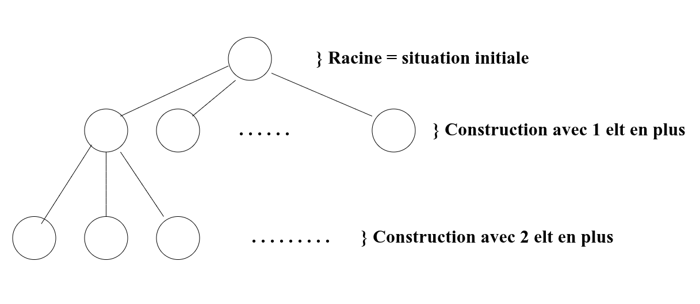

# Chapitre 10: Exploration Exhaustive

Chapitre qui présente 2 méthodes algorithmiques. Il est appliquable quand il est impossible de se ramener à des sous problèmes.

## I. Recherche par force brute

__Types de problèmes :__

- Problèmes de décisons:
  - On a une propriété $P$ sur un ensemble $E$ et on cherche $e \in E$ tq $P(e)$ soit vraie.
- Parfois utilisée en optimisation / combinatoire.

> __Principe__
>
> Tester toutes les possibilités, i.e. explorer tout l'ensemble $E$ pour tester la propriété $P$.

```pseudo-code
POUR chaque élement e de E:
    SI P(e) est vrai:
        RENVOYER e
    FIN SI
```

__Complexité :__

- $card(E)$ itérations.
- On applique $P$ à chaque itération.
- $O(card(E \times (\text{complexité de }P))$

Il faut aussi prendre en compte la complexité de la *construction* de $E$ (parfois immédiate). La plupart du temps c'est de la complexité en plus.

$\to$ complexité souvent trop importante pour être effectuée. On peut améliorer légèrement la complexité moyenne à l'aide d'une __droite de balayage__.

> __Droite de balayage__
>
> On explore $E$ dans un ordre précis du plus probable au moins probable.

## II. Back-tracking (retour sur trace)

$\to$ s'applique principalement aux problèmes de décisions.

> __Principe__
>
> Construire les solutions potentielles petit à petit, en revenant en arrière sur les constructions précédentes si la construction actuelle ne peut pas répondre aux contraintes.

On peut représenter l'algo de backtracking à l'aide d'un arbre:



Les feuilles sont les solutions potentielles. L'algo se déroule sur le même principe qu'un parcours en profondeur.

__Algo :__

- On suppose la fonction  
  - `racine()` qui renvoie une construction vide
  - `fils(construction partielle)` qui renvoie toutes les construction possibles
  - `est_feuille(construction)` (assez explicite)

```pseudo-code
FONCTION backtracking(construction):
  SI est_feuille(construction):
    SI P(construction):
      construction est solution
    FIN SI
  SINON
    POUR chaque construction suivante dans fils(construction):
      backtracking(construction suivante)
    FIN POUR
  FIN SI
FIN FONCTION
```

__Complexité :__ Dans le pire des cas, même que pour la recherche par force brute.

$\to$ le backtracking est utile avec des optimisations.

> __Élagage de l'arbre__
>
> On ne continue pas sur les construction qui sont sûre de ne pas aboutir

- L'arbre des constructions a moins de branches. En contre partie la vérification a une complexité.
- Généralement le backtracking est toujours utilisé avec l'élagage de l'arbre.

> __Mémoïsation des constructions partielles__
>
> Explicite.

___

> __Heuristique__
>
> regarder les fils dans un ordre qui donne le plus de chance d'aboutir clairement.
>
> Une __heuristique__ est une fonction `h` une construction. Plus l'heuristique de la construction est haute plus elle a de chance d'aboutir (et inversement).

- *Avantage:* Permet d'aboutir plus vite
- *Inconvénient:* l'heuristique doit être calculée efficacement
