# Chapitre 11 : les Graphes

-> structure ralationnelle crée pour résoudre le pb du pont de konigsberg.
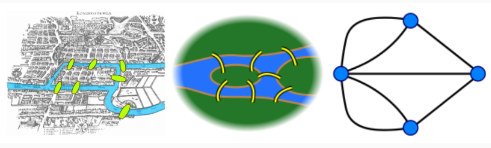

## I. Définitions

### 1. Graphes non orientés

> __Def__ : un graphe est un couple $(S, A)$:
>
>- $S$ est un enseble non vide do$s_1$ est accessible depuis $s_2$ nt les élément sont appelés sommets.
>- $A$ est un enseble de paires non ordonnées $\{s_1, s_2\}$ avec $s_1 \in S$ et $s_2 \in S$ et $s_1 \neq s_2$, dont les éléments sont appelés arrêtes.

Ex : 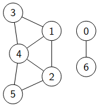

On peut adapter cette définition.

$\to$ multi-arrête

$\to$ boucles

- Notation: $\{s_1, s_2\} = s_1-s_2$

__Voc__ : Une arrête est *incidente* à un sommet et $s_1$ et $s_2$ sont dit *voisins*.

__Prop__:
$$card(A)\leq \frac{card(S)\times (card(S)-1)}{2}$$

### 2. Graphes orientés

>__Def__ : un graphe est un couple $(S, A)$:
>
>- $S$ est un enseble non vide dont les élément sont appelés sommets.
>- $A$ est un enseble de couples ordonnées $(s_1, s_2)$ avec $s_1 \in S$ et $s_2 \in S$ et $s_1 \neq s_2$, dont les éléments sont appelés arcs

Ex : 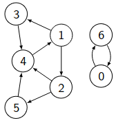

On peut adapter cette définition.

$\to$ multi-arrête

$\to$ boucles

- __Notation__: $(s_1, s_2) = s_1\to s_2$

__Voc__ : $s_1$ est appelé *prédécesseur* de $s_2$ et $s_2$ est le successeur de $s_1$.

__Prop__:
$$card(A) \leq card(S)\times (card(S)-1)$$

## II. Vocabulaire de la théorie des Graphes

### 1. Degré

> $\underline {\text{Dans un graphe orienté}}$, le degré d'un sommet $s$ noté $d(s)$ est le nombre d'arrêtes incidentes à ce sommet. i.e. son nombre de voisins.

__Prop__ : Soit $G = (S, A)$ un GNO et soit $s \in S$,

- $$0\leq d(s) \leq card(S) -1$$
- $$\sum_{s\in S}d(s)=2\times card(A)$$

>$\underline {\text{Dans un graphe orienté, si} \space s \in S:}$
>
>- Son degré entant, noté $d_-(s)$, est sont nombre de prédécesseurs.
>- Son degré sortant, noté $d_+(s)$, est sont nombre de successeurs.

__Prop__ : Soit $G = (S, A)$ un GO et soit $s \in S$,

- On a les inégalité suivantes :
  - $$0 \leq d_-(s) \leq card(S)-1$$
  - $$0 \leq d_+(s) \leq card(S)-1$$
- $$\sum_{s \in S}d_-(s) = \sum_{s \in S}d_+(s) = card(A)$$

### 2. Sous-graphes

>Soit $G = (S, A)$ un graphe.
>
>$G' = (S', A')$ est un sous graphe de G si:
>
>- $S' \subset S$ (et $S'$ est non vide)
>- $A' \subset A$ avec $\{s_1, s_2\}/(s_1, s_2) \in A' \implies s_1 \in S' \land s_2 \in S'$

$G'$ est un sous-graphe __induit__ de $G$ si en plus $A'$ est l'intégralité des arrêtes / arcs reliant deux sommets de $S'$ dans $G$.

Exemple (à gauche, un sous graphe (sommets noirs et arêtes pleines) ; à droite, un sous-graphe induit): 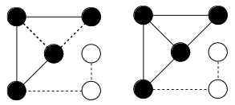

__Prop__ : un graphe $G = (S, A)$ possède $2^{card(S)}-1$ sous graphes induits.

### 3. Isomorphisme

> Un isomorphisme entre 2 graphes $G = (S, A)$ et $\tilde{G} = (\tilde{S}, \tilde{A})$ est une bijection $\varphi : S \to \tilde{S}$ telle que $\forall (s_1, s_2) \in S, \{s_1, s_2\} \in A \implies \{\varphi (s_1), \varphi (s_2)\} \in \tilde{A}$

Autrement dit, en renommant les sommets, les deux graphes ont exactement les mêmes ensembles d'arcs/arrêtes.

Exemple : 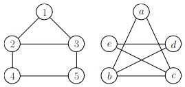

### 4. Chemins

>Un chemin de longueur $n$ dans un graphe $G = (S, A)$ est une suite de $n + 1$ sommets $s_0, s_1, s_2,\dots,s_n$ telle que $\forall i \in [\![0, n-1]\!], \{s_i, s_{i+1}\} \in A$.

- Un chemin de longueur $n$ a $n$ arrêtes/arcs.

- On accepte les chemins de longueur $0$.

Un chemin est dit __élémentaire__ s'il ne passe pas 2 deux fois par le même sommet.

Un chemin est dit __simple__ s'il ne passe pas deux fois par la/le même arrête/arc.

- __Prop :__ Tout chemin est un chemin élémentaire est simple (se prouve trivialement par l'absurde).

___

>Un __cycle__ est un chemin simple, dans un GNO, de longueur non nulle dont les extrémotés sontle même sommet. Un cycle élémentaire est un cycle où la seule répétition est l'extrémité. On l'appelle __circuit__ dans les GO.

Dans un GNO, les cycles sont au moins de longueur $3$.

Dans un GO, les circuit dont au moins de longueur $2$.

- __Prop__ : Les 3 points sont équivalents :
  1. Il existe un chemin de $s_1$ à $s_2$.
  2. Il existe un chemin simple de $s_1$ à $s_2$.
  3. Il existe un chemin élémentaite de $s_1$ à $s_2$.

### 5. Accessibilité

> Un sommet $s_2$ est dit __accessible__ depuis un sommet $s_1$ s'il existe un chemin allant de $s_1$ à $s_2$. On note $s_1 \leadsto s_2$.

- __Prop:__ Dans un GNO la relation d'accessibilité est une relation d'équivalence. (Preuve triviale.) Cependant dans un GO la symétrie n'est pas vérifiée.

### 6. Connexité

$\underline{\text{Dans un GNO.}}$

> Un GNO est dit __connexe__ si tous sommet du graphe est accessible depuis tout autre sommet. Les __composantes connnexes__ d'un GNO sont les sous-graphes induits par la relation d'équivalence d'accessibilité.

Un graphe est connexe $\iff$ il possède une seule composante connexe.

- __Prop:__ Soit $G = (S, A)$ un GNO, et soient $s_1 \in S$ et $s_2 \in S$ deux sommets non voisins. (i.e. $\{s_1, s_2\} \notin A$).
Alors si $\tilde G = (S, A \cup \{s_1, s_2\})$, il y a 2 cas possibles:
  1. Si $s_1$ et $s_2$ appartiennent à la même composante connexe dans $G$ alors $\tilde G$ possède le même nombre de composantes connexes que G. Cependant on crée forcément un nouveau cycle.
  2. Sinon $\tilde G$ possède une composante connexe de moins que $G$. Tout chemin reliant les 2 composantes connexes passe forcément par $s_1-s_2$.

Cette propriété se montre avec une récurrence sur les arrêtes.

$\underline{\text{Dans un GO.}}$

>- Un GO est dit __fortement connexe__ si, pour tout sommet $s_1$ et $s_2$ d graphe, il existe un chemin reliant $s_1$ à $s_2$.
>- Un GO est dit __faiblement connexe__ si, l'oublie de l'orientation donne un graphe connexe.
>- Un GO est dit __fortement connexe__ si, pour tout sommet $s_1$ et $s_2$ d graphe, il existe un chemin reliant $s_1$ à $s_2$ ou un chemin reliant $s_2$ à $s_1$.

Exemples (un graphe fortement connexe et un non fortement connexe (sommet noir non accessible depuis le sommet gris)) :

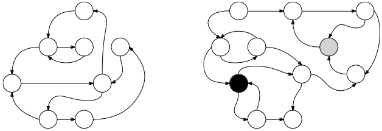

La relation $R$ définie sur les GO par:

- $s_1 R s_2 \iff$ ($s_1$ est accessible depuis $s_2$ et $s_2$ est accessible depuis $s_1$)

est une relaion d'équivalence.

> Les __composantes fortement__ connexes d'un GO sont les sous-graphes induits par la classe d'équivalence de cette relation $R$.

Un GO à une composante fortement connexe est fortement connexe.

Il y a aussi existance de la notion de composante faiblement connexe.

### 7. Coloration d'un graphe

> __Def :__
>
> - Une __K-coloration__ dans un graphe $G = (S, A)$ est une fonction $\varphi: k \mapsto [\![0;k-1]\!]$ tq $\forall (s_1, s_2) \in  S², s_1-s_2 \in A \implies \varphi(s_1) \neq \varphi(s_2)$.
> - Un graphe est dit __K-colorable__ quand il possède une K-coloration.
> - Le __nombre chromatique__ d'un graphe $G$, noté $\chi(G)$, est le plus petit entier $k$ tel que $G$ est K-colorable.

- __Prop__:  
$$1 \leq \chi(G) \leq card(S)$$

Les problème d'ordonnancement se traduisent par un problème de coloration de graphe d'intervalles correspondants.

*ex: sélection d'activité, plus petit sommets possible dans la même couleur : 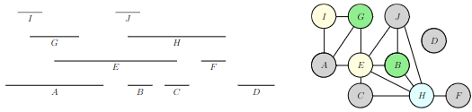

## III. Graphes particuliers

### 1. Formes particulières

> - Graphes __entièrement déconnecté__:
>
>$G = (S,A)$ avec $A = \emptyset$.

___

>- Graphes __Complets__ :
>
>$G = (S, A)$ tel que $\forall (s_1, s_2) \in S², s_1-s_2 \in A$, un GNO complet a $\frac{card(S)\times (card(S)-1)}{2}$ arrêtes. Un GO complet a $card(S)\times (card(S) - 1)$ arcs.

___

>- __Graphes Chemins__:
>
>Les seuls arrêtes du graphe relient un sommet $i$ au sommet $i+1$.

On peut aussi avoir des GO chemins.

>- __Graphes Cycles__:
>
>(des graphes chemins mais qui relient le dernier sommet au premier.)

### 2. Prop particulières

__Vocabulaire:__

- __creux__ = pax beaucoup d'arrêtes/arcs.

- __denses__ = bcp d'arrêtes\arcs.

Aide à choisir la repr du graphe.

>__biparti__ :
>
> Un graphe $G = (S, A)$ est dit biparti si on peut séparer S en deux sous ensembles disjoints $S_A$ et $S_B$ tels que $\forall(s_1,s_2)\in S², s_1-s_2 \implies s_1 \in S_A \land s_2 \in S_B$ ou inversement.

Les graphes biparti sont 2-colorables.

>__biparti-complet__:
>
>En reprenant la def des graphes biparties, on ajoute que tout sommet de $S_A$ est relié à tout sommet de $S_B$.

___

>__Planaire__:
>
>On peut trouver une repr grarphique sur un plan tel qu'aucun arc/arrête se croise.

- __Prop:__ Le graphe complet à $5$ sommets et biparti-complet à $3 + 3$ sommets sont les plus petits graphes planaires. Tout graphe qui contient un de ces deux sous graphes n'est pas planaire.

$\underline{\text{graphes eulériens :}}$

__Vocabulaire :__

- Un __chemin eulérien__ est un chemin simple qui passe par toutes les arrêtes du graphe (i.e. de longueur $card(A)$).
- Un __cycle eulérien__ est un chemin eulérien où les deux extrémités sont le même sommet.

> Un __graphe eulérien__ est un graphe qui possède un cycle eulérien.

$\underline{\text{graphes hamiltonniens :}}$

__Vocabulaire :__

- Un __chemin hamiltonien__ est un chemin élémentaire qui passe par toutes les arrêtes du graphe (i.e. de longueur $card(S) -1 $).
- Un __cycle hamiltonien__ est un chemin hamiltonien où la seule répétition de sommet est e départ et l'arrivée.

> Un __graphe hamiltonien__ est un graphe qui possède un cycle hamiltonien.

## 3. les Arbres

> On peut redéfinir une notion "d'arbre" dans le voc de la théorie des graphes. Un arbres est un graphe __connexe__ est __acyclique__ (i.e. pas de cycles).

⚠️ On ne retrouve pas les arbres définis inductivement.

__GNO acycliques__:

- __Prop:__ tout GNO acyclique possède un sommet de degré inférieur ou égal à 1.
  - Preuve par l'absurde : Supposons que tous les degrés soit supérieur ou égal à 2. On peur construire un chemin allant de sommet en sommet sans 2 arrêtes consécutives égales (les degré étant supérieur ou égal à 2, on peut se déplacer sur un sommet différent de celui sont on vient). Le nombre de sommet étant fini on finit par revenir sur un sommet déhà dans le chemin i.e. on crée un cycle.

- __Théorème__ : Un GNO acyclique $G=(S, A)$ possède au plus $card(S) - 1$ arrêtes.
  - Preuve: Par récurrence sur le nb de sommets:
  - Un graphe à 1 sommet possède 0 arrête.
  - Supposons le th vrai pour un graphe à $n$ sommets. Montrons le résultat pour un graphe à $n+1$ sommets. Soit $G$ un graphe à $n+1$ sommets. D'après la prop présédente, $G$ possède un sommet $s$ tal que $d(s) \leq 1$. Le sous-graphe induit de $G$ privé de $s$ est acyclique à $n$ sommets donc par H.R. a $n-1$ arrêtes. Donc le nombre d'arrêtes de $G$ est de $n - 1 + d(s) \leq n$. Ce qui clôt la récurrence.

__GNO connexes__:

- __Théorème__: Un GNO connexe $G=(S, A)$ possède au moins $card(S) -1$ arrêtes.
  - Preuve: par récurrence:
  - Hérédité: $H_n \implies H_{n+1}$. Soit $G$ un GNO à $n+1$ sommets. Par disjonction de cas:
    - S'il existe un sommet $s$ de degré 1, le sous graphe induit de $G$ privé de $s$ est connexe à $n$ sommets. donc par H.R. possède au moins $n-1$ arrêtes. Donc $G$ possède $n-1+1 = n$ arrêtes.
    - Si tous les sommets sont au moins de degré 2. $\frac{1}{2} \sum_{s\in S}d(s) = card(A)$ donc ici comme pour tout sommet $s$, $d(s) \geq 2$, on a $\frac{1}{2} \sum_{s \in S}d(s) \geq card(S)$ i.e. $card(A) \geq card(S)$.
    - Ce qui clôt la récurrence.

__Caractérisation des arrbres__:

- Soit $G = (S, A)$ un GNO. Les énoncés suivant sont équivalents:
  1. $G$ est un arbre.
  2. $G$ est acyclique et a $card(S) -1$ arrêtes.
  3. $G$ est connexe et a $card(S) -1$ arrêtes.
  4. Pour tout sommets $s_1$ et $s_2$ de $G$ il existe un unique chemin élémentaite de $s_1$ à $s_2$.
  5. $G$ est minimalement connexe.
  6. $G$ est maximalement acyclique.

     - Preuve: Les th précedents donne $1. \implies 2.$ et $1 \implies 3.$.

     - Montrons que $3. \implies 1.$. Par l'absurde, supposons un graphe $G=(S, A)$ connexe avec $card(A) = card(S) -1$ possède un cycle. $G$ privé de cette arrête est tonjours connexe et possède $card(S) - 2$ arrêtes. Impossible.

     - Mq $2. \implies 1.$ Prenons un graphe $G=(S,A)$ acyclique tel que $card(A) = card(S) -1$. Montrons que $G$ possde 1 seule composante connexe. Notons $c$ le nombre de composantes connexes de $G$. et $n_1, n_2, \dots , n_c$ les nb de sommets de ces composantes connexes. Les composantes connexes sont des arbres. (connexes par définition et acyclique car G est acyclique.) Donc une composante connexe à $n_i$ sommets possède $n_i -1$ arrêtes.Le nb d'arrêtes de G est $\sum_{i=1}^{c}(n_i -1) = card(S) - c$ comme $card(A) = card(S) -1$ alors $ c=1$ donc $G$ connexe.

     - Mq $1 \iff 4.$ Si $G$ est un arbre alors il est acyclique et connexe. Soit $s_1$ et $s_2$ des sommets de $G$. Donc $s_2$ est accessible depuis $s_1$. Si ce chemin n'est pas unique alors il existe un cycle dans $G$. Réciproquement, si pour tout sommets il existe un unique chemin, il y a l'accessibilité, donc la connexité et l'unicité du chemin implique l'acyclicité. D'où l'équivalence.

> __Retour sur le vocabulaire des arbres__
>
> - Une __forêt__ est un GNO acyclique. Ses composantes connexes sont donc des arbres.
>
> - Un __arbre enraciné__ est un arbre (connexe et acyclique) dont on a distinguer un sommet particulier comme étant la racine.

-> Ex:

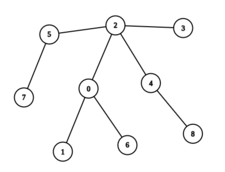
est un arbre

et si on l'enracine en 0 on a : 

> __Def__:
>
> un __arbre couvrant__ est un graphe $G = (S,A)$ est un sous-graphe $\tilde G = (\tilde S, \tilde A)$ tel que $\tilde S = S$ (même sommets) et $\tilde A \subset A$ tel que $\tilde G $ est un arbre (connnexe acyclique).

- __Théorème__ : Tout GNO connexe admet un arbre couvrant.
  - Considérons l'algo suivant:

    - Entrée : un graphe $G = (S, A)$ non orienté connexe

    - ```pseudocode
      On prend G' = (S, A') avec A' = A
      TANT QUE |A'| > |S|-1 FAIRE
        on prend a appartenant à A' telle que G' privé de a est connexe
        A' <- A'\{a}
      FIN TANT QUE
      RENVOYER G' ```
  - Variant: $card(A')$; et invariant: $G'$ est connexe.

### 4. Graphes pondérés

> __Def__:
>
> - un graphe podéré est un graphe $G = (S, A, \omega)$ avec $S$ l'ensemble des sommets, $A$ l'ensemble des arcs/arrêtes, et $\omega : A \mapsto \R$ une __fonction de pondération__ qui à un arc aussocie son __poids__
> - On étend usuéellement $\omega$ pour que $s_1-s_2 \notin A \implies \omega(s_1-s_2) = +\infty$.

$\to$ Application: les gaphes pondérés représentent bien tous les tyes de réseaux.

> __Def__: On définit le poids d'un chemin $s_1, s_2, \dots, s_n$ dans un graphe pondéé comme :
> $$\sum_{i=1}^{n-1}\omega (s_i-s_{i+1})$$

Un pb classique sur les graphes pondérés consiste à trouver le plus petit poids entes deux sommets.

## 4. Representation des graphes

### 1. Matrice d'adjacence

$\to$ Sommets sont numérotés $0, 1, 2, \dots, |S|-1$.

> Les matrices d'adjacence $M$ d'un graphe $G = (S, A)$ est une matrice de dimension $|S| \times |S|$ telle que le coeff lige $i$ colonne $j \in [\![1, |S|]\!]$ vaut
> $$M_{ij} = \begin{cases} 1 \space \text{si il y a une arrête / arc} \\ 0 \space \text{sinon} \end{cases}$$

Ex: 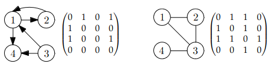

__Prop :__

- La matrice d'adjacence d'un GNO est symétrique.

- La diagonale d'une matrice d'adjacence est remplie de 0 (sauf si les boucles sont autorisées).

- Si $M$ est la mat d'adjacence d'un graphe. Soit $k \in \N$. $M^k$ donne la ligne $i$ colonne $j$, le nombre de chemins de longueur $k$ allant de $i$ à $j$.
  - Preuve par récurrence sur $k$.
    - *Initialisation* :
      - Pour $k = 0$, $M⁰$ est l'identité, ce qui est correct car les seulrs chemins de longueur $0$ sont seux reliant un sommet à lui même.
      - Pour $k = 1$, $M¹ = M$ ce qui est correct par définition de la matrice d'adjacence.
    - *Heredité* : Mqntrons le résultat vrai pour $M^{k+1}$. Un chemin de longueur $k+1$  reliant $i$ à $j$ est un chemin de longueur $1$ de $i$ jusqu'un certain sommet $s$ concaténé à un chemin de longueur $k$ de $s$ à $j$. Par hypothèse de récurrence le nb de chemins de cette forme est $M_{i,s}¹ \times M_{s,j}^k$. Donc au totale le nb de chemins de $i$ à $j$ est :

$$
\sum_{s \in S}M_{i,s} \times M_{s,j}^k = M_{i,j}^{k+1}
$$

__Avantages / Inconvénients__ :

- Complexité Spatiale : $O(|S|²)$.
Pour les graphes denses, c'est adapté mais pour les graphes creux, cette repr est pas idéale.

- Complexité temporelle des op principales :

  - 2 sommets sont-ils $\begin{cases} \text{voisins} \\ \text{précedent/successeurs} \end{cases}$ On est en $O(1)$, un seul coeff à regarder.
  - récupérer tous les $\begin{cases} \text{voisins} \\ \text{successeurs} \end{cases}$ d'un sommet. O(|S|), on regarde toute la ligne.
  - pour les GO, récupérer les prédécesseurs est en $O(|S|)$ car on regarde toutes lec colonnes.
  - ajouter/enlever $\begin{cases} \text{une arrête} \\ \text{un arc} \end{cases}$ $O(1)$, un seul coeff à modifier dans la matrice.

__En OCaml__ :

```OCaml
type mat_adj = int array array
```

__En C__ :

```c
tyoedef int mat[100]; // 10 sommets max dans la matrice.
struct mat_adj_s {
  int nb_sommets;     // compris entre 1 et 10
  mat matrice;        // matrice linéarisée
};
```

### 2. Liste d'adjacence

Pour chaque sommet on lui associe la liste de ses $\begin{cases} \text{voisins} \\ \text{successeurs} \end{cases}$.

__Avantages / Inconvénients__ :

- Complexité spatiale : $O(|S| + |A|)$. Très adapté pour les graphes creux.

- Complexité temporelle des opérations principales :
  - Tester si 2 sommets $i$ et $j$ sont $\begin{cases} \text{voisins} \\ \text{predecesseurs/successeurs} \end{cases}$. $O(d_+(i))$
  - Récupérer les $\begin{cases} \text{voisins} \\ \text{successeurs} \end{cases}$ d'un sommet. $O(1)$.
  - Pour les GO, récupérer les prédecesseurs. $O(|S| + |A|)$ car on regarde tout.
  - ajouter/supprimer $\begin{cases} \text{une arrête} \\ \text{un arc} \end{cases}$ :
    - ajouter en tête d'une liste : $O(1)$
    - enlever $\begin{cases} \text{arc} \space i \to j : O(d_+(i)) \\ \text{une arrête} \space i-j: O(d(i) + d(j))  \end{cases}$

__En OCaml__ :

```OCaml
type list_adj = int list array
```

__En C__ : Les listes seront implémentés par des tableaux avec:

- Soit le degré stocké dans la première case
- Soit une sentinnelle $-1$ pour marquer la fin des voisins

```C
typedef int list[10][10];
struct list_asj_s {
  int nb_sommets ;
  list liste;
};
```

### 3. Autre représentations

Quand les sommets ne sont pas dans $\N$.

$\to$ On associe à chaque sommet un entier unique entre $0$ et $|S| - 1$ en stockant les correspondances dans un tableaux puis on utilise liste/matrice d'adjacence comme avant.

$\to$ Pour une liste d'adj on peut la stocjer dans un tableau sssociatif dont les clés sont les sommets et les valeurs les listes de $\begin{cases} \text{successeurs} \\ \text{voisins} \end{cases}$.

⚠️ impose que les noms de sommets appartiennent à un ensemble totalement ordonné.

```OCAML
type lst = ('a, 'a list) Hashtbl.t
```

>__Méthode__: Serialisation des graphes
>
> - Première ligne à nombre de sommets.
> - Lignes suivantes : $i, j$ telles que $i-j \in A$. Avec cette methode les arrêtes $i-j$ apparaissent sur 2 lignes : $i-j$ et $j-i$.
>
>Si les sommets ne sont pas numérotés, on stocke leurs noms dans le fichier après la première ligne (avant les arc/arrêtes)

## 5. Parcours de graphes

On retrouve les parcours en profondeur et en largeur.

2 différences avec les parcours d'arbres:

- On doit fixer un __sommet de départ__.
- On doit se souvenir des sommets déjà traités.

### 1. Parcours en profondeur

```pseudocode
FONCTION parcours_profondeur(graĥe G, sommet dep)
  vus <- {}
  FONCTION explorer(sommet s)
    SI s n'appartient pas vus ALORS

      traitement(s)
      vus <- ajouter s

      POUR chaque voisin.successeur v de s dans G FAIRE
        explorer(v)
      FIN POUR
    FIN SI
  
  FIN FONCTION
  explorer(dep)
FIN FONCTION
```

Ex : 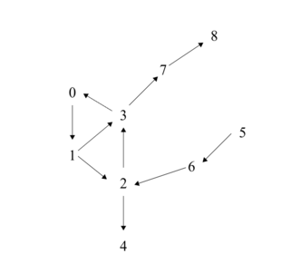

$$
\begin{vmatrix}
  \text{vus}  &  \text{Ordre de traitement} \\
  \text{\{\}}  & \\ \hline
  \{0\}  &  0 \\
  \{0, 1\}  &  1 \\
  \{0, 1 ,2\}  &  2 \\
  \{0, 1, 2, 3\}  &  3 \\
  \{0, 1, 2, 3, 7\}  & 7 \\
  \{0, 1, 2, 3, 7, 8\}  & 8 \\
  \{0, 1, 2, 3, 7, 8, 4\} &  4

\end{vmatrix}
$$

__Arborescence__ du parcours de graphe tel que $(s_1,s_2) \in A$ si le traitrment de $s_2$ a été lancé pour sont voisin.predecesseur $s_1$. Les sommets sont ceux traités.

sur l'ex : 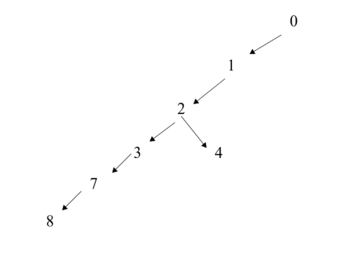

- __Prop :__ Le parcours en profondeur visite exactement les sommets accessible depuis le sommet de départ.

### 2. Parcours en largeur

```pseudocode
FONCTION parcours_largeur(graphe G, sommet dep)
  a_traiter <- file vide
  a_traiter <- enfiler dep
  vus <- {dep}
  TANT QUE a_traiter est non vide FAIRE
    s <- defiler a_traiter
    traitement(s)
    POUR caque voisin.seccesseur v de s dans G Faire
      SI v n'appartient pas vus ALORS
        a_traiter <-  enfiler v
        vus <- ajouter v
      FIN SI
    FIN POUR
  FIN TANT QUE
FIN FONCTION
```

Exemple (même graphe que la partie précédente) :

$$
\begin{vmatrix}
  \text{vus} &&&  \text{a\_traiter}  &&&  \text{ordre} \\\hline
  \{\}  &&&  \leftarrow\underline{\overline{0 \space  \space \space \space \space \space \space }}  &&&   \\
  \{\}  &&&  \leftarrow\underline{\overline{1 \space  \space \space \space \space \space \space }}  &&&  0 \\
  \{\}  &&&  \leftarrow\underline{\overline{2-3}}  &&&  1 \\
  \{\}  &&&  \leftarrow\underline{\overline{3-4}}  &&&  2 \\
  \{\}  &&&  \leftarrow\underline{\overline{4-7}}  &&&  3 \\
  \{\}  &&&  \leftarrow\underline{\overline{7 \space  \space \space \space \space \space \space }}  &&&  4 \\
  \{\}  &&&  \leftarrow\underline{\overline{8 \space  \space \space \space \space \space \space }}  &&&  7 \\
  \{\}  &&&  \emptyset  &&&  8
\end{vmatrix}
$$
On peut aussi faire l'arborescence pour le parcours en largeur.

- __Prop__ : Le parcours en latgeur visite exactement les sommets accessible depuis le sommet de départ.

> __Def :__ La distance d'un sommet $s_1$ à un sommet $s_2$ notée $\delta(s_1,s_2)$ est le nb minimal d'arcs.arrêtes d'un chemin reliant $s_1$ à $s_2$. Si $s_2$ est non accessible depuis $s_1$ on concidère que $\delta(s_1,s_2) = + \infty$.

- __Prop__ : Le parcours en largeur traite les sommets par distances croissantes par rapport au départ.
  - Preuve : Par invariant du `TQ` : La file `a_traitrer` contient les sommets $\overline{\underline{s_1 s_2 \dots s_n}}$ tels que $\delta(dep, s_1) \leq \delta(dep, s_2) \leq \dots \leq \delta(dep, s_n) \leq \delta(dep, s_1) +1$.

### 3. Algo générique

Que se passe-t-il si on remplace la file par une pile dans le parcours en largeur ?

```pseudocode
FONCTION parcours_generique(graphe G, sommet dep)
  vus <- {}
  a_traiter <- structure de données
  a_traiter <- ajouter dep
  TANT QUE a_traiter non vide
    s <- extraire a_traiter
    SI s n'appartient pas vus ALORS
      traitement(s)
      vus <- ajouter s
      POUR chaque voisin.successeur v de s dans G
        a_traiter <- ajouter v
      FIN POUR
    FIN SI
  FIN TANT QUE
FIN FONCTION
```

Si `a_trater` est muni :

- d'une stratégie FIFO, on retrouve l'ordre d'un parcours en largeur.
- d'une stratégie LIFO, on retrouve le parcours en profondeur.
- d'une stratégie aléatoire, parcours quelconque.

__Complexités :__

- Spatiale:
  - vus est de taille $|S|$ au max.
  - `a_traiter` est en $O(|A|)$ car chaque sommet $s$ peut se retrouver $d(s)$ fois dans `a_traiter`.
  - Total $O(|S| + |A|)$

- Temporelle :
  - en supposant les op sur `a_traiter` sont en $O(1)$
  - en supposant travailler avex la liste d'adjavence : la boucle `POUR` est en space $O(d(s)$
  - Pour `vus`
    - soir c'est un tab associatif implémenté par une table de hachage
    - soit c'est un tableau de booléens.
    - Dans les 2 cas, la création de vus est en $O(|S|)$ et l'ajout $+$ test d'appartenance sont en $0(1)$.
  - Chaque sommet est traité au plus une fois (grâce à vu). Le traitement d'un sommet (entrée dans le `SI`) est en $O(d(s)) + O(1) = O(d(s))$
  - Au totalla boucle tant que est en $\sum_{s \in S} O(d(s)) = O(|A|)$
  - TOTAL : $O(|S|) + O(1) + O(|A|) = O(|S| + | A|)$
  
Remarque : on a les même complexité temporelle pour le parcours en profondeur et en largeur.

### 4. Application des parcours

GNO et __connexité__

- n'importe lequel des 3 algos peut être adapté
- vérifier que tous les sommets sont dans `vus`

GNO: trouver les composantes connnexes

- avec n'importe quel algo on lance un parcours avec n'importe quel sommetde départ ce sommet de départ ce qui donne sa comp_connexe on recommance avec un sommet non vu, etc...

trouver les distances de départ à tous les autres sommets

- on adapte le parcours en __largeur__
- Avant le TQ, la seule distance sonnue est $\delta (dep,dep)=0$. Quand on enfile, le nouveau sommet v, le plus petit chemin jusque v a comme dernière arrête.arcs $s-v$ donc $\delta (dep, v) = \delta (dep, s) + 1$
  
Determiner si un graphe est biparti

- On choisit un sommet de départ, on le place dans une partition. Quand on explore un sommet, on essaie de places ses voisins dans la partitin opposée. Si un des voisins avait d"jà été placé et que les partitions ne correspondent pas $\implies$ pas biparti.
- On repète ces étapes jusqu'à avoir vu tous les sommets.

Rechercher un cycle dont le départ fait partie.

- Si on retombe une seconde fois sur le sommet il est dans le cycle. On retient à chaque fois les sommet dont on vient (les prédécesseur dans l'aborescence) pour reconstruire le cycle.

$\underline{\text{Tri topologique}}$

$\leadsto$ ne s'applique que sur les GO.

> __Def__ :
>
> - Un *ordre topologique* est une relation d'ordre totale $\prec$ talle que si $s_1 \to s_2 \in A$ alors $s_1 \prec s_2$
> - Un *tri topologique* est une énumération de tous les sommets qui respecte l'ordre topologique.

- __Prop__ : Un graphe orienté admet un ordre topologique si et seulement s'il est acyclique.
  - Preuve :
    - $\implies$ : Par l'absurde supposons que la graphe ait un cycle. Soient deux sommets $\neq s_1$ et $s_2$ dans ce cycle il y a un chemin de $s_1$ à $s_2$ donc $s_1 \prec s_2$ et il y a un chemin de $s_2$ à $s_1$ donc $s_2 \prec s_2$. Ceci est absurde par anti-cymétrie de la relation $\prec$
    - $\impliedby$ : Par récurrence sur le nb de sommets.
      - Un graphe à 1 sommet : trivial
      - Soit $G$ un graphe à $n > 1$ sommets acyclique. Soit $s$ un sommet du graphe $G$ tem que $d_-(s) = 0$ (existe nécessairement) le graphe induit par $S \backslash \{s\}$  est acyclique à $n-1$ sommets. Donc par H.R. admet un ordre topologique. Comme tous les arcs implquant s sont de la forme $s \to s'$ il suffit de considerer que $s$ est inférieur à tous les autres sommest selon l'ordre topologique.

__Adaptation à faire :__

- Parcours en profondeur
- Le sommet dont l'exploration récursive termine en premier sera le dernier au tri topologique. Le sommet dont l'exploration fini en deuxième sera l'avant dernier au tri. etc.
