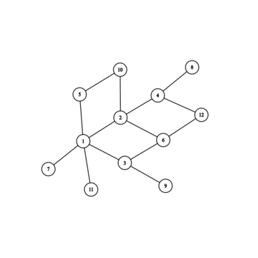

# Chapitre 12 : Ensemble Ordonnées et inductifs

## Partie 0: À savoir

### Vocabulaire à connître

- reflecive, transitive, symétrie, anti-symétrie
- relation d'équivalence
- relation d'ordre
- prédécesseur.successeur $\pm$ immédiat
- ordre __total__
- elt minimal / maximal
- minimum / maxium
- ensemble __bien fondé__

### Savoir faire

- Dessiner le graphe associé à un ensemble ordonné (p.4 du poly)

### À savoir par coeur

- ⚠️ Théorème page 6. "Enseble bien fondé $\iff$ il n'existe pas de suite strictement décroissante."

__La suite du fichier donne la corréction de la plupart des exos du poly.__

## Partie I

### Partie 2

- Tout sommet est accessible de lui même par un chemin de longueur 0. $\to R$ est reflexive.
- En mettant bout à bout les chemin on a la transitivité de $R$
- La symétrie est triviale.

### Partie 3

#### Exo 1

- Même argument pour la réflexibilité.
- IDEM pour la transitivité.
- Comme le graphe est acyclique si 2 sommets $\neq$ alors on a un cycle ce qui n'est pas possible. D'où l'anti-symétrie.

#### Exo 2

#### Exo 4

Par l'absurde: Si le graphe est cyclique.
Alors il existe un chemin de taille $n$ (non nul) tel que $s_1 s_2\dots s_n s_1$ soit un cycle.
Donc $s_2 \prec s_n$ et $s_n \prec s_2$, absurde.
Donc le graphe est acyclique.
