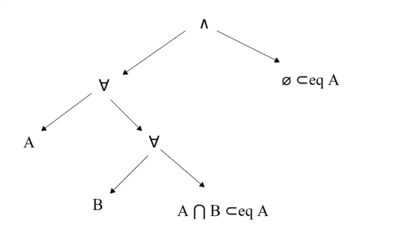

# Chapitre 13 : Logique

objectif : formaliser le discours, le raisonnement, la démonstration.

$\leadsto$ __Syntaxe__: règles, outils permettant d'écrire des formules.

$\leadsto$ __Sémantique__: sens, interprétation des formules.

## I. Syntace des formules

### 1. Formules propositionnelles

>__Def__: Une *variable propositionnelle* est une proposition élémentaire pouvant être vraie ou fausse.
___

>__Def__: Les *constantes logiques* sont :
>
> - $\top$ désignant une proposition toujours vraie
> - $\bot$ désignant une proposition toujours fausse

___

>__Def__: Soit $V$ l'ensemble des variables propositionnnelles on définit uninductivemment l'ensemble $P_V$ des formules propositionnnelles.
>
>- __Assetions__ :
>   - une vatiable est une formule: $V \subset P_V$ .
>   - les consantes logiques sont des formules i.e. $\top \in P_V$ et $\bot \in P_V$ .
>
>- __Règles d'inférences__ :
>   - Soit $\neg$ le connecteur de négation et $\varphi \in P_V$ . Alors $\neg \varphi \in P_V$ .
>   - Soit $\land$ le connecteur de conjonction et $\psi$ et $\varphi \in P_V$. Alors $(\psi \land \varphi) \in P_V$ .
>   - Soient $\lor$ le connecteur de disjonction, $\rightarrow$ le connecteur d'implication et $\leftrightarrow$ le connnecteur d'équivalence. Soient $\psi$ et $\varphi \in P_V$. Alors $(\psi \lor \varphi) \in P_V, (\psi \rightarrow \varphi) \in P_V$ et $(\psi \leftrightarrow \varphi) \in P_V$

Pour simplifier les écritures on définit pour la suite du cours $\diamond \in \{\lor, \land, \rightarrow, \leftrightarrow\}$ le connecteur générique.

Ex:

- "Il pleut et je prends mon parapluie." Soit $x$ la variable signifiant "Il pleut", et $y$ la variable "Je prends mon parapluie". Alors la phrase devient $(x \land y)$.

- "Si j'ai cours de math ou si j'ai cours d'info alors je prends mon cahier." On pose $x$ la variable propositionnelle signifiant "j'ai cours de math", $y$ signifiant "j'ai cours d'info" et $z$ signifiant "je prends mon cahier". On a alors $((x \lor y) \rightarrow z)$

__Représentation arborescente__ : Toute formule propositionnelle peut être représentée par un arbre. Dans un arbre $\top$ et $\bot$ sont des feuilles et
$\diamond$ en noeud interne.
___

__Propsitions :__

- Les représentations arborescentes des formules prop. sont des arbres binaires non stricts. Rmp: connecteurs $\neg$ est d'arité 1 et connnecters $\land, \lor, \rightarrow, \leftrightarrow$ sont d'arrité 2.
- La syntaxe de la fomule se retrouve avec un parcours *infixe* de la repr arboresente.

___

$\leadsto$ Repr d'une formule en C / OCaml.

```OCaml
type 'a fp = 
    | Var of 'a
    | Top
    | Bottom
    | Not of 'a fp
    | Or of ('a fp * 'a fp)
    | And of ('a fp * 'a fp)
    | Impl of ('a fp * 'a fp)
    | Iff of ('a fp * 'a fp)
```

```C
struct fp_s {
    char* etiquette; // un type énuméré ne fonctionne pas 
    // pour les variables prop.
    // Il faut vérifier que les règles syntaxiques sont respectés.
    struct fp_s* gauche;
    struct fp_s* droite;
};
```

### 2. Fonctions sur les formules propositionnnelles

#### __Taille__ d'une formule prop

Idée $=$ taille de l'arbre.

*Définition inductive* de la taille $\mathcal{T}$:

- Assertions : $\mathcal{T}(\top) = 1$ et $\mathcal{T}(\bot) = 1$. Soit $v \in V$ alors $\mathcal{T}(v) = 1$
- Règles d'inférence :
  - Soit $\varphi \in P_V$ alors $\mathcal{T}(\neg \varphi) = 1 + \mathcal{T}(\varphi)$.
  - Soient $\varphi, \psi \in P_V$ alors $\mathcal{T}(\varphi \diamond \psi) = 1 + \mathcal{T}(\varphi) + \mathcal{T}(\psi)$

___

#### __Hauteur__ d'une formule prop

Idée $=$ hauteur de l'arbre.

*Définition inductive* de la hauteur $\mathcal{H}$:

- Assertions : $\mathcal{H}(\top) = 0$ et $\mathcal{H}(\bot) = 0$. Soit $v \in V$ alors $\mathcal{H}(v) = 0$
- Règles d'inférence :
  - Soit $\varphi \in P_V$ alors $\mathcal{H}(\neg \varphi) = 1 + \mathcal{H}(\varphi)$.
  - Soient $\varphi, \psi \in P_V$ alors $\mathcal{H}(\varphi \diamond \psi) = 1 + max(\mathcal{H}(\varphi), \mathcal{H}(\psi))$

___

#### __Sous-formule__ d'une formule prop

Idée $=$ une sous-formule est une partie de la formule qui est syntaciquement une formule prop.

*Définition inductive* de $\mathcal{S_F}$ l'ensemble des sous formules.:

- Assertions : $\mathcal{S_F}(\top) = \top$ et $\mathcal{S_F}(\bot) = \bot$. Soit $v \in V$ alors $\mathcal{S_F}(v) = \{v\}$
- Règles d'inférence :
  - Soit $\varphi \in P_V$ alors $\mathcal{S_F}(\neg \varphi) = \{\neg \varphi\} \cup \mathcal{S_F}(\varphi)$.
  - Soient $\varphi, \psi \in P_V$  alors $\mathcal{S_F}(\varphi \diamond \psi) = \{\varphi \diamond \psi\} \cup \mathcal{S_F}(\varphi) \cup \mathcal{S_F}(\psi)$

___

#### __Sous-formule__ d'une variable par une formule prop

Idée $=$ remplacer la variable à chaque endroit où la variable est présente dans la formule.

*Définition inductive* de $\varphi[\psi/x]$ substitution de $x$ par $\psi$ dans la formule $\varphi$:

- Assertions : $\top[\psi/x] = \top$ et $\bot[\psi/x] = \bot$. Soit $v \in V$ alors:

$$
\begin{cases}
  v[\psi/x] = \psi \space \text{si} \space v = x \\
  v[\psi/x] = v \space \text{sinon}  
\end{cases}
$$

- Règles d'inférence :
  - Soit $\varphi \in P_V$ alors $(\neg \varphi) [\psi/x] = \neg (\varphi[\psi/x])$.
  - Soient $\varphi, \varphi' \in P_V$ alors $(\varphi \diamond \varphi') [\psi/x] = (\varphi[\psi/x] \diamond \varphi'[\psi/x])$

### 3. Logique du $1^{er}$ ordre

Objectif : pouvoir manipuler des objets qui ne sont pas justes "vrai ou faux".

$\underline{Exemple}$ : $2 \leq x + 1 < 3y$.

>__Def__ (domaine): un domaine est composé
>
>- d'un ensemble de variables $X$
>- d'un ensemble de fonctions d'arité $a$ définies sur $X^{a}$ noté $S_f^{a}$.
>- d'un ensemble de prédicats d'arrité $a$ noté $S_p^a$.

___

>__Def__ (terme):
>
>- Toute variable de $X$ est un terme.
>- Si $f \in S_f^a$ et $t_1, t_2, \dots, t_a$ sont des termes alors $f(t_1, t_2, \dots, t_a)$ est un terme.

___
  
>__Def__ (atome) : Si $t_1, t_2, \dots, t_a$ sont des termes et $p \in S_p^a$ alors $p(t_1, t_2, \dots, t_a)$ est un atome.

Retour sur l'exemple : $2 \leq x + 1 < 3y$

- Domaine :
  - $X = \{x, y\}$
  - $S_f^2 = \{+, \times\}$
  - $S_f⁰ = \{1, 2, 3\}$
  - $S_p¹ = \{\leq\}$

$\underline{Exemple}$ 2 : "Tous les hommes sont mortels. Socrate est un homme. Donc Socrate est mortel." Pour transformer cette phrase il nous faut les quantificateur.

>__Def__ (quantificateurs):
>
>- Le symbole $\forall$ désigne le quantificateur universel.
>- Le symbole $\exists$ désigne le quantificateur existentiel.

___

>__Def__ de l'ensemble des formules du premier ordre sur un domaine.
>
>- Assertion: un atome est une formule du premier ordre.
>- Règles d'inférence:
>   - Si $\varphi$ est une formle du permier ordre et $\neg$ le connecteur de négation alors $\neg \varphi$ est une formule du permier ordre.
>   - Si $\varphi$ et $\psi$ sont des formles du permier ordre alors $(\varphi \diamond \psi)$ est une formule du premier ordre et $\diamond \in \{\lor, \land, \rightarrow, \leftrightarrow\}$ connecteur d'arité 2.
>   - Si $\varphi$ est une formule du permier ordre et $x$ une variable de $X$ alors $\forall x \cdot \varphi / \exists x \cdot \varphi$ sont des formules du permier ordre.

On peut représenter les formules par un arbre.

Ex : Formule du premier ordre $((\forall A, \space \forall B, \space A \cap B \subseteq A) \land (\emptyset \subseteq A))$.

- Domaine :
  - $X = \{1, B\}$
  - $S_f⁰ = \{\emptyset\}$
  - $S_f² = \{\cap\}$
  - $S_p² = \{\subseteq\}$

- Arbre 

__Vocabulaire__ :

- *Portée* d'une variable $x$ dans une formule $\forall x \cdot \varphi / \exists x \cdot \varphi$ est la formule $\varphi$.

- Variable *libre/liée* : une occurrence d'une variable $x$ est liée/libre si elle apparaît/n'apparaît plus à la suite d'un $\forall x \cdot / \exists x \cdot$. Une variable est dite liée/libre si elle a au moins une occurrence liée/libre.
  
Ex: Dans la formule précédente $A$ libre et liée et $B$ liée.

$\mapsto$ Les fonctions inductives sur l'ensemble des formules propositionnnelles pourraient être définies sur les formules du premier ordre.
Attention pour la substitution, on ne peut pas substituer les variables liées.

## II. Sémentique

__Vocabulaire__ :

- On appelle *variable de vérité* la valeur "vrai", noté $V$, et "faux", noté $F$.

### 1. Valeur de vérité d'une formule

- Une *fonction booléenne* associé à un connnecteur $\diamond$ donne la valeur de vérité de $\psi \diamond \varphi$ en fonction des valeurs de vérité de $\psi$ et $\varphi$.

$\underline{Exemples}$ :

- Soit $f_\neg$ la fonction booléénne qui associe au connecteur la négation on a:

$$
\begin{cases}
  f_\neg(V) = F \\
  f_\neg(F) = V
\end{cases}
$$

- Soit $f_\land$ la fonction booléénne qui associe au connecteur la conjonction on a:

$$
\begin{cases}
  f_\land(F,F) = F \\
  f_\land(F,V) = F \\
  f_\land(V,F) = F \\
  f_\land(V,V) = V
\end{cases}
$$

(On défnit de même les fonctions $f_\lor, f_\rightarrow, f_\leftrightarrow$.)

> __Def:__ une *valuation* est une fonction associant à chaque variable propositionnnelle une valeur de vérité.

___

> __Def:__ Evaluation d'une formule $\varphi$ par une valuation $v$, notée $[\![ \varphi]\!] _v$
>
>- Assertion:
>   - $[\![ \top]\!]_v = V$
>   - $[\![ \bot]\!]_v = F$
>   - $[\![ x]\!] _v = v(x) \space \text{avec} \space x \in V$
>- Règle d'inférence:
>   - $[\![ \neg \varphi]\!]_v = f_{\neg} ([\![ \varphi]\!]_v)$
>   - $[\![ \varphi \diamond \psi]\!]_v = f_{\diamond} ([\![ \varphi]\!]_v, [\![ \psi]\!]_v)$

$\underline{Exemple}$ : $\mathcal = \{x, y\}$ et $\varphi = ((x \rightarrow y) \lor (x \land \neg y)) \land (x \lor \neg y)$
Soit $v$ la validation défnie par $\begin{cases} v(x) = F \\ v(y) = F \end{cases}$.

Alors:

$$
\begin{align}
  [\![ \varphi]\!] _v &= f_\land ([\![ (x \rightarrow y) \lor (x \land \neg y)]\!] _v, [\![ x \lor \neg y]\!] _v) \\
    &= f_\land (f_\lor ([\![ x \rightarrow y]\!] _v,[\![ x \land \neg y]\!] _v) , f_\lor ([\![ x, \neg y]\!] _v)) \\
    & = f_\land (f_\lor (f_\rightarrow([\![ x]\!] _v, [\![ y]\!] _v),f_\land([\![ x]\!] _v, f_\neg([\![ y]\!] _v))) , f_\lor ([\![ x]\!] _v, f_\neg( [\![ y]\!] _v))) \\
    &= f_\land (f_\lor (f_\rightarrow(F, F),f_\land(F, f_\neg(F))) , f_\lor (F, f_\neg(F))) \\
    &= f_\land (f_\lor (V,f_\land(F, V)) , f_\lor (F, V)) \\
    &= f_\land (f_\lor (V,F) , V) \\
    &= f_\land (V , V) \\
    &= V
\end{align}
$$

$\to$ Une *table de vérité* d'ube formule $\varphi$ permet de résumer $[\![ \varphi]\!] _v$ pour chque valuation $v$ existante.

| $v(x)$ | $v(y)$ | $[\![ (x \rightarrow y) \lor (x \land \neg y ]\!] _v$ | $[\![ x \lor \neg y]\!] _v$ | $[\![ \varphi]\!] _v$ |
| :-: | :-: | :-: | :-: | :-: |
| $F$ | $F$ | $V$ | $V$ | $V$ |
| $F$ | $V$ | $F$ | $V$ | $F$ |
| $V$ | $F$ | $V$ | $F$ | $F$ |
| $V$ | $V$ | $V$ | $V$ | $V$ |

___

__Propriété :__

- Si $V$ contient $n$ variable prop. Une formule $\in P_V$ contient $2^n$ lignes pour une table de vérité (i.e. $2^n$ validations existantes).
- Il y a $2^{2^n}$ tables de vérité existantes pour l'ensemble des formules à $n$ variables prop.

__Vocabulaire :__

- Un *modèle* d'une formule propostionnelle $\varphi$ est une validarion $v$ tq $[\![ \varphi]\!] _v = V$. On dit que le modèle *satisfait* $\varphi$. on note $Mod(\varphi)$ l'ensemble des modèles de $\varphi$.
- Une formule $\varphi$ est dite *satisfiable* si $Mod(\varphi) \neq \emptyset$
- Une formule $\varphi$ est une *antilogie* si $Mod(\varphi) = \emptyset$
- Une formule $\varphi$ est une *tautologie* si toute valuation est un modèle de $\varphi$. On note $\vDash \varphi$.

$\to$ Pour étudier ces trois caractéristiques, on peut simplement dresser la table de vérité de la formule.

$\underline{Remarque}$ $\top$ est une tautologie et $\bot$ est une antilogie.

### 2. Equivalence et conséquence sémantique

> __Def:__ Une formule $\psi$ est une conséquence sémantique d'une formule $\varphi$ quand toute valuation qui satisfait $\varphi$ satidfait $\psi$. Autrement dit quand $Mod(\varphi) \subset Mod(\psi)$. On note $\varphi \vDash \psi$

$\underline{Généralisation :}$ Une formule $\psi$ est une conséquence sémantique *d'un ensemble* de formules $\Gamma$ quand toute valuation qui satisfait toute formule de $\Gamma$ satisfait aussi $\psi$. On le note aussi $\Gamma \vDash \psi$.

$\to$ Pour étudier la conséquence sémantique on fait les tables de vérité de toutes les formules impliquées.

$\underline{Exemple}$: $V = \{x, y\}$. Montrer que $x \land y \vDash x \rightarrow y$

| $v(x)$ | $v(y)$ | $[\![ x \land y]\!] _v$ | $[\![ x \rightarrow y]\!] _v$ |
| :-: | :-: | :-: | :-: |
| $F$ | $F$ | $F$ | $V$ |
| $F$ | $V$ | $F$ | $V$ |
| $V$ | $F$ | $F$ | $F$ |
| $V$ | $V$ | $V$ | $V$ |

> __Def :__ Deux formules $\varphi$ et $\psi$ sont dites *sémantiquement équivalentes* si $Mod(\varphi) = Mod(\psi)$. On note $\varphi \equiv \psi$.

__Propriétés :__

- Si $\varphi \equiv \psi$ alors $\varphi \vDash \psi$ et $\psi \vDash \varphi$.
- $\equiv$ est une relation d'équivalence. Ceci est immédiat du fait que $=$ est une relation d'équivalence.
- (impact de la substitution) Si $\varphi \equiv \nu$. Soit $x \in V$ et $\psi \in P_V$.
  - $\varphi[\psi/x] \equiv \nu[\psi/x]$
  - $\psi[\varphi/x] \equiv \psi[\nu/x]$ ces deux propriétés se montre par induction structurelle.
