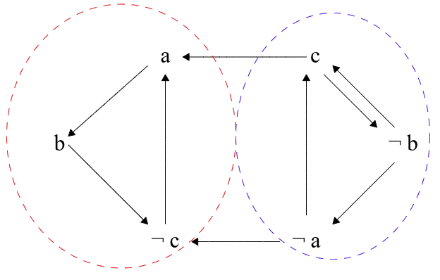
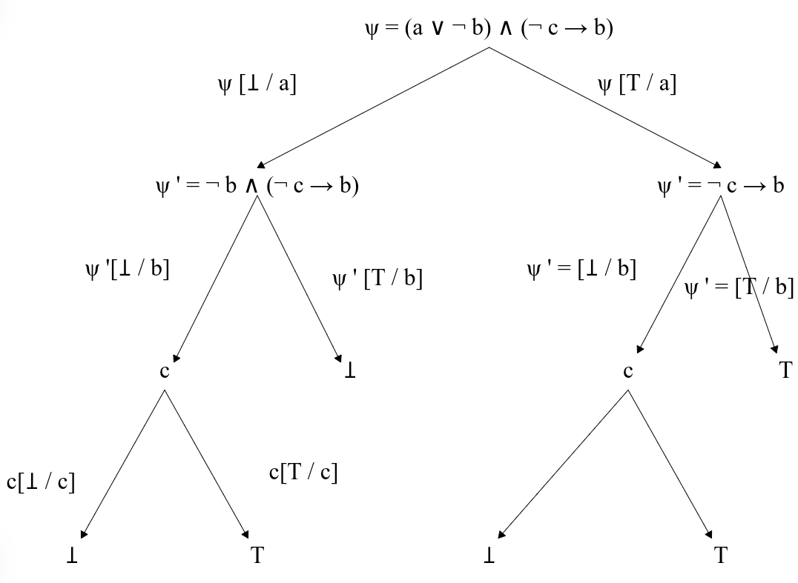

# Chapitre 13 : Logique

objectif : formaliser le discours, le raisonnement, la démonstration.

$\leadsto$ __Syntaxe__: règles, outils permettant d'écrire des formules.

$\leadsto$ __Sémantique__: sens, interprétation des formules.

## I. Syntaxe des formules

### 1. Formules propositionnelles

>__Def__: Une *variable propositionnelle* est une proposition élémentaire pouvant être vraie ou fausse.
___

>__Def__: Les *constantes logiques* sont :
>
> - $\top$ désignant une proposition toujours vraie
> - $\bot$ désignant une proposition toujours fausse

___

>__Def__: Soit $V$ l'ensemble des variables propositionnnelles on définit inductivemment l'ensemble $P {\scriptstyle V}$ des formules propositionnnelles.
>
>- __Assetions__ :
>   - une variable est une formule: $V \subset P {\scriptstyle V}$ .
>   - les constantes logiques sont des formules i.e. $\top \in P {\scriptstyle V}$ et $\bot \in P {\scriptstyle V}$ .
>
>- __Règles d'inférences__ :
>   - Soit $\neg$ le connecteur de négation et $\varphi \in P {\scriptstyle V}$ . Alors $\neg \varphi \in P {\scriptstyle V}$ .
>   - Soit $\land$ le connecteur de conjonction et $\psi$ et $\varphi \in P {\scriptstyle V}$. Alors $(\psi \land \varphi) \in P {\scriptstyle V}$ .
>   - Soient $\lor$ le connecteur de disjonction, $\rightarrow$ le connecteur d'implication et $\leftrightarrow$ le connnecteur d'équivalence. Soient $\psi$ et $\varphi \in P {\scriptstyle V}$. Alors $(\psi \lor \varphi) \in P {\scriptstyle V}, (\psi \rightarrow \varphi) \in P {\scriptstyle V}$ et $(\psi \leftrightarrow \varphi) \in P {\scriptstyle V}$

Pour simplifier les écritures on définit pour la suite du cours $\diamond \in \{\lor, \land, \rightarrow, \leftrightarrow\}$ le connecteur générique.

Ex:

- "Il pleut et je prends mon parapluie." Soit $x$ la variable signifiant "Il pleut", et $y$ la variable "Je prends mon parapluie". Alors la phrase devient $(x \land y)$.

- "Si j'ai cours de math ou si j'ai cours d'info alors je prends mon cahier." On pose $x$ la variable propositionnelle signifiant "j'ai cours de math", $y$ signifiant "j'ai cours d'info" et $z$ signifiant "je prends mon cahier". On a alors $((x \lor y) \rightarrow z)$

__Représentation arborescente__ : Toute formule propositionnelle peut être représentée par un arbre. Dans un arbre $\top$ et $\bot$ sont des feuilles et
$\diamond$ en noeud interne.
___

__Propsitions :__

- Les représentations arborescentes des formules prop. sont des arbres binaires non stricts. Rmp: connecteurs $\neg$ est d'arité 1 et connnecters $\land, \lor, \rightarrow, \leftrightarrow$ sont d'arrité 2.
- La syntaxe de la fomule se retrouve avec un parcours *infixe* de la repr arboresente.

___

$\leadsto$ Repr d'une formule en C / OCaml.

```OCaml
type 'a fp = 
    | Var of 'a
    | Top
    | Bottom
    | Not of 'a fp
    | Or of ('a fp * 'a fp)
    | And of ('a fp * 'a fp)
    | Impl of ('a fp * 'a fp)
    | Iff of ('a fp * 'a fp)
```

```C
struct fp_s {
    char* etiquette; // un type énuméré ne fonctionne pas 
    // pour les variables prop.
    // Il faut vérifier que les règles syntaxiques sont respectés.
    struct fp_s* gauche;
    struct fp_s* droite;
};
```

### 2. Fonctions sur les formules propositionnnelles

#### __Taille__ d'une formule prop

Idée $=$ taille de l'arbre.

*Définition inductive* de la taille $\mathcal{T}$:

- Assertions : $\mathcal{T}(\top) = 1$ et $\mathcal{T}(\bot) = 1$. Soit $v \in V$ alors $\mathcal{T}(v) = 1$
- Règles d'inférence :
  - Soit $\varphi \in P {\scriptstyle V}$ alors $\mathcal{T}(\neg \varphi) = 1 + \mathcal{T}(\varphi)$.
  - Soient $\varphi, \psi \in P {\scriptstyle V}$ alors $\mathcal{T}(\varphi \diamond \psi) = 1 + \mathcal{T}(\varphi) + \mathcal{T}(\psi)$

___

#### __Hauteur__ d'une formule prop

Idée $=$ hauteur de l'arbre.

*Définition inductive* de la hauteur $\mathcal{H}$:

- Assertions : $\mathcal{H}(\top) = 0$ et $\mathcal{H}(\bot) = 0$. Soit $v \in V$ alors $\mathcal{H}(v) = 0$
- Règles d'inférence :
  - Soit $\varphi \in P {\scriptstyle V}$ alors $\mathcal{H}(\neg \varphi) = 1 + \mathcal{H}(\varphi)$.
  - Soient $\varphi, \psi \in P {\scriptstyle V}$ alors $\mathcal{H}(\varphi \diamond \psi) = 1 + max(\mathcal{H}(\varphi), \mathcal{H}(\psi))$

___

#### __Sous-formule__ d'une formule prop

Idée $=$ une sous-formule est une partie de la formule qui est syntaxiquement une formule prop.

*Définition inductive* de $\mathcal{S_F}$ l'ensemble des sous formules.:

- Assertions : $\mathcal{S_F}(\top) = \top$ et $\mathcal{S_F}(\bot) = \bot$. Soit $v \in V$ alors $\mathcal{S_F}(v) = \{v\}$
- Règles d'inférence :
  - Soit $\varphi \in P {\scriptstyle V}$ alors $\mathcal{S_F}(\neg \varphi) = \{\neg \varphi\} \cup \mathcal{S_F}(\varphi)$.
  - Soient $\varphi, \psi \in P {\scriptstyle V}$  alors $\mathcal{S_F}(\varphi \diamond \psi) = \{\varphi \diamond \psi\} \cup \mathcal{S_F}(\varphi) \cup \mathcal{S_F}(\psi)$

___

#### __Substitution__ d'une variable par une formule prop

Idée $=$ remplacer la variable à chaque endroit où la variable est présente dans la formule.

*Définition inductive* de $\varphi[\psi/x]$ substitution de $x$ par $\psi$ dans la formule $\varphi$:

- Assertions : $\top[\psi/x] = \top$ et $\bot[\psi/x] = \bot$. Soit $v \in V$ alors:
  - $v[\psi/x] = \psi$ si $v = x$
  - $v[\psi/x] = v$ sinon  
- Règles d'inférence :
  - Soit $\varphi \in P {\scriptstyle V}$ alors $(\neg \varphi) [\psi/x] = \neg (\varphi[\psi/x])$.
  - Soient $\varphi, \varphi' \in P {\scriptstyle V}$ alors $(\varphi \diamond \varphi') [\psi/x] = (\varphi[\psi/x] \diamond \varphi'[\psi/x])$

### 3. Logique du $1^{er}$ ordre

Objectif : pouvoir manipuler des objets qui ne sont pas justes "vrai ou faux".

$\underline{\text{Exemple}}$ : $2 \leq x + 1 < 3y$.

>__Def__ (domaine): un domaine est composé
>
>- d'un ensemble de variables $X$
>- d'un ensemble de fonctions d'arité $a$ définies sur $X^{a}$ noté $S_f^{a}$.
>- d'un ensemble de prédicats d'arrité $a$ noté $S_p^a$.

___

>__Def__ (terme):
>
>- Toute variable de $X$ est un terme.
>- Si $f \in S_f^a$ et $t_1, t_2, \dots, t_a$ sont des termes alors $f(t_1, t_2, \dots, t_a)$ est un terme.

___
  
>__Def__ (atome) : Si $t_1, t_2, \dots, t_a$ sont des termes et $p \in S_p^a$ alors $p(t_1, t_2, \dots, t_a)$ est un atome.

Retour sur l'exemple : $2 \leq x + 1 < 3y$

- Domaine :
  - $X = \{x, y\}$
  - $S_f^2 = \{+, \times\}$
  - $S_f⁰ = \{1, 2, 3\}$
  - $S_p¹ = \{\leq\}$

$\underline{\text{Exemple}}$ 2 : "Tous les hommes sont mortels. Socrate est un homme. Donc Socrate est mortel." Pour transformer cette phrase il nous faut les quantificateur.

>__Def__ (quantificateurs):
>
>- Le symbole $\forall$ désigne le quantificateur universel.
>- Le symbole $\exists$ désigne le quantificateur existentiel.

___

>__Def__ de l'ensemble des formules du premier ordre sur un domaine.
>
>- Assertion: un atome est une formule du premier ordre.
>- Règles d'inférence:
>   - Si $\varphi$ est une formle du permier ordre et $\neg$ le connecteur de négation alors $\neg \varphi$ est une formule du permier ordre.
>   - Si $\varphi$ et $\psi$ sont des formles du permier ordre alors $(\varphi \diamond \psi)$ est une formule du premier ordre.
>   - Si $\varphi$ est une formule du permier ordre et $x$ une variable de $X$ alors $\forall x \cdot \varphi / \exists x \cdot \varphi$ sont des formules du permier ordre.

On peut représenter les formules par un arbre.

Ex : Formule du premier ordre $((\forall A, \space \forall B, \space A \cap B \subseteq A) \land (\emptyset \subseteq A))$.

- Domaine :
  - $X = \{A, B\}$
  - $S_f⁰ = \{\emptyset\}$
  - $S_f² = \{\cap\}$
  - $S_p² = \{\subseteq\}$

- Arbre 

__Vocabulaire__ :

- *Portée* d'une variable $x$ dans une formule $\forall x \cdot \varphi / \exists x \cdot \varphi$ est la formule $\varphi$.

- Variable *libre/liée* : une occurrence d'une variable $x$ est liée/libre si elle apparaît/n'apparaît plus à la suite d'un $\forall x \cdot / \exists x \cdot$. Une variable est dite liée/libre si elle a au moins une occurrence liée/libre.
  
Ex: Dans la formule précédente $A$ libre et liée et $B$ liée.

$\mapsto$ Les fonctions inductives sur l'ensemble des formules propositionnnelles pourraient être définies sur les formules du premier ordre.
Attention pour la substitution, on ne peut pas substituer les variables liées.

## II. Sémantique

__Vocabulaire__ :

- On appelle *variable de vérité* la valeur "vrai", noté $V$, et "faux", noté $F$.

### 1. Valeur de vérité d'une formule

- Une *fonction booléenne* associé à un connnecteur $\diamond$ donne la valeur de vérité de $\psi \diamond \varphi$ en fonction des valeurs de vérité de $\psi$ et $\varphi$.

$\underline{\text{Exemples}}$ :

- Soit $f {\scriptstyle \neg}$ la fonction booléénne qui associe au connecteur la négation on a:

$$
\begin{cases}
  f {\scriptstyle \neg}(V) = F \\
  f {\scriptstyle \neg}(F) = V
\end{cases}
$$

- Soit $f {\scriptstyle \land}$ la fonction booléénne qui associe au connecteur la conjonction on a:

$$
\begin{cases}
  f {\scriptstyle \land}(F,F) = F \\
  f {\scriptstyle \land}(F,V) = F \\
  f {\scriptstyle \land}(V,F) = F \\
  f {\scriptstyle \land}(V,V) = V
\end{cases}
$$

(On défnit de même les fonctions $f {\scriptstyle \lor}, f {\scriptstyle \rightarrow}, f {\scriptstyle \leftrightarrow}$.)

> __Def:__ une *valuation* est une fonction associant à chaque variable propositionnnelle une valeur de vérité.

___

> __Def:__ Evaluation d'une formule $\varphi$ par une valuation $v$, notée $[\![ \varphi]\!]  {\scriptstyle v}$
>
>- Assertion:
>   - $[\![ \top]\!] {\scriptstyle v} = V$
>   - $[\![ \bot]\!] {\scriptstyle v} = F$
>   - $[\![ x]\!]  {\scriptstyle v} = v(x) \space \text{avec} \space x \in V$
>- Règle d'inférence:
>   - $[\![ \neg \varphi]\!] {\scriptstyle v}$ $=$ $f_{\neg} ([\![ \varphi]\!] {\scriptstyle v})$
>   - $[\![ \varphi \diamond \psi]\!] {\scriptstyle v}$ $=$ $f_{\diamond} ([\![ \varphi]\!] {\scriptstyle v},$ $[\![ \psi]\!] {\scriptstyle v})$

$\underline{\text{Exemple}}$ : $\mathcal = \{x, y\}$ et $\varphi = ((x \rightarrow y) \lor (x \land \neg y)) \land (x \lor \neg y)$
Soit $v$ la validation défnie par :

$$
\begin{cases}
  v(x) = F \\
  v(y) = F
\end{cases}
$$

Alors:

$$
\begin{align*}
  [\![ \varphi]\!]  {\scriptstyle v} &= f {\scriptstyle \land} ([\![ (x \rightarrow y) \lor (x \land \neg y)]\!]  {\scriptstyle v}, [\![ x \lor \neg y]\!]  {\scriptstyle v}) \\
    &= f {\scriptstyle \land} (f {\scriptstyle \lor} ([\![ x \rightarrow y]\!]  {\scriptstyle v},[\![ x \land \neg y]\!]  {\scriptstyle v}) , f {\scriptstyle \lor} ([\![ x, \neg y]\!]  {\scriptstyle v})) \\
    & = f {\scriptstyle \land} (f {\scriptstyle \lor} (f {\scriptstyle \rightarrow}([\![ x]\!]  {\scriptstyle v}, [\![ y]\!]  {\scriptstyle v}),f {\scriptstyle \land}([\![ x]\!]  {\scriptstyle v}, f {\scriptstyle \neg}([\![ y]\!]  {\scriptstyle v}))) , f {\scriptstyle \lor} ([\![ x]\!]  {\scriptstyle v}, f {\scriptstyle \neg}( [\![ y]\!]  {\scriptstyle v}))) \\
    &= f {\scriptstyle \land} (f {\scriptstyle \lor} (f {\scriptstyle \rightarrow}(F, F),f {\scriptstyle \land}(F, f {\scriptstyle \neg}(F))) , f {\scriptstyle \lor} (F, f {\scriptstyle \neg}(F))) \\
    &= f {\scriptstyle \land} (f {\scriptstyle \lor} (V,f {\scriptstyle \land}(F, V)) , f {\scriptstyle \lor} (F, V)) \\
    &= f {\scriptstyle \land} (f {\scriptstyle \lor} (V,F) , V) \\
    &= f {\scriptstyle \land} (V , V) \\
    &= V
\end{align*}
$$

$\to$ Une *table de vérité* d'ube formule $\varphi$ permet de résumer $[\![ \varphi]\!]  {\scriptstyle v}$ pour chque valuation $v$ existante.

| $v(x)$ | $v(y)$ | $[\![ (x \rightarrow y) \lor (x \land \neg y ]\!]  {\scriptstyle v}$ | $[\![ x \lor \neg y]\!]  {\scriptstyle v}$ | $[\![ \varphi]\!]  {\scriptstyle v}$ |
| :-: | :-: | :-: | :-: | :-: |
| $F$ | $F$ | $V$ | $V$ | $V$ |
| $F$ | $V$ | $F$ | $V$ | $F$ |
| $V$ | $F$ | $V$ | $F$ | $F$ |
| $V$ | $V$ | $V$ | $V$ | $V$ |

___

__Propriété :__

- Si $V$ contient $n$ variable prop. Une formule $\in P {\scriptstyle V}$ contient $2^n$ lignes pour une table de vérité (i.e. $2^n$ validations existantes).
- Il y a $2^{2^n}$ tables de vérité existantes pour l'ensemble des formules à $n$ variables prop.

__Vocabulaire :__

- Un *modèle* d'une formule propostionnelle $\varphi$ est une validarion $v$ tq $[\![ \varphi]\!]  {\scriptstyle v} = V$. On dit que le modèle *satisfait* $\varphi$. on note $Mod(\varphi)$ l'ensemble des modèles de $\varphi$.
- Une formule $\varphi$ est dite *satisfiable* si $Mod(\varphi) \neq \emptyset$
- Une formule $\varphi$ est une *antilogie* si $Mod(\varphi) = \emptyset$
- Une formule $\varphi$ est une *tautologie* si toute valuation est un modèle de $\varphi$. On note $\vDash \varphi$.

$\to$ Pour étudier ces trois caractéristiques, on peut simplement dresser la table de vérité de la formule.

$\underline{\text{Remarque}}$ $\top$ est une tautologie et $\bot$ est une antilogie.

### 2. Equivalence et conséquence sémantique

> __Def:__ Une formule $\psi$ est une conséquence sémantique d'une formule $\varphi$ quand toute valuation qui satisfait $\varphi$ satisfait $\psi$ . Autrement dit quand $Mod(\varphi) \subset Mod(\psi)$ . On note $\varphi \vDash \psi$

$\underline{\text{Généralisation :}}$ Une formule $\psi$ est une conséquence sémantique *d'un ensemble* de formules $\Gamma$ quand toute valuation qui satisfait toute formule de $\Gamma$ satisfait aussi $\psi$. On le note aussi $\Gamma \vDash \psi$.

$\to$ Pour étudier la conséquence sémantique on fait les tables de vérité de toutes les formules impliquées.

$\underline{\text{Exemple}}$: $V = \{x, y\}$. Montrer que $x \land y \vDash x \rightarrow y$

| $v(x)$ | $v(y)$ | $[\![ x \land y]\!]  {\scriptstyle v}$ | $[\![ x \rightarrow y]\!]  {\scriptstyle v}$ |
| :-: | :-: | :-: | :-: |
| $F$ | $F$ | $F$ | $V$ |
| $F$ | $V$ | $F$ | $V$ |
| $V$ | $F$ | $F$ | $F$ |
| $V$ | $V$ | $V$ | $V$ |

> __Def :__ Deux formules $\varphi$ et $\psi$ sont dites *sémantiquement équivalentes* si $Mod(\varphi) = Mod(\psi)$. On note $\varphi \equiv \psi$.

__Propriétés :__

- Si $\varphi \equiv \psi$ alors $\varphi \vDash \psi$ et $\psi \vDash \varphi$.
- $\equiv$ est une relation d'équivalence. Ceci est immédiat du fait que $=$ est une relation d'équivalence.
- (impact de la substitution) Si $\varphi \equiv \nu$. Soit $x \in V$ et $\psi \in P {\scriptstyle V}$.
  - $\varphi[\psi/x] \equiv \nu[\psi/x]$
  - $\psi[\varphi/x] \equiv \psi[\nu/x]$ ces deux propriétés se montre par induction structurelle.

#### Équivalences sémantiques fondamentales (se prouvent toutes par table de vérité)

- Tiers exclus
  - $\varphi \land \neg \varphi \equiv \bot$
  - $\varphi \lor \neg \varphi \equiv \top$

- Element neutre
  - $\varphi \land \top \equiv \varphi$
  - $\varphi \lor \bot \equiv \varphi$
  
- Élément absorbant
  - $\varphi \land \bot \equiv \bot$
  - $\varphi \lor \top \equiv \top$

- Lois de Morgan
  - $\neg (\varphi \land \psi) \equiv \neg \varphi \lor \neg \psi$
  - $\neg (\varphi \lor \psi) \equiv \neg \varphi \land \neg \psi$

- Décomposition de l'implication
  - $\varphi \rightarrow \psi \equiv \neg \varphi \lor \psi$

- Associativité
  - $(\varphi \land \psi) \land \theta \equiv \varphi \land (\psi \land \theta)$
  - $(\varphi \lor \psi) \lor \theta \equiv \varphi \lor (\psi \lor \theta)$

- Distributivité
  - $\varphi \land (\psi \lor \theta) \equiv (\varphi \land \psi) \lor (\varphi \land \theta)$
  - $\varphi \lor (\psi \land \theta) \equiv (\varphi \lor \psi) \land (\varphi \lor \theta)$

- Commutativité
  - $\varphi \land \psi \equiv \psi \land \varphi$
  - $\varphi \lor \psi \equiv \psi \lor \varphi$

- Curryfication
  - $(\varphi \land \psi) \rightarrow \theta \equiv \varphi \rightarrow (\psi \rightarrow \theta)$

- Contraposition
  - $\varphi \rightarrow \psi \equiv \neg \psi \rightarrow \neg \varphi$

- Double implication
  - $\varphi \leftrightarrow \psi \equiv (\varphi \rightarrow \psi) \land (\psi \rightarrow \varphi)$

- Disjonction de cas
  - $(\varphi \rightarrow \psi) \land (\neg \varphi \rightarrow \psi) \equiv \psi$

- Absurde
  - $\neg \varphi \rightarrow \bot \equiv \varphi$

- Idempotence
  - $\varphi \land \varphi \equiv \varphi$
  - $\varphi \lor \varphi \equiv \varphi$

- Double négation
  - $\neg \neg \varphi \equiv \varphi$

Preuve pour décomposition de l'implication

| $[\![\varphi]\!] {\scriptsize v}$ | $[\![\psi]\!] {\scriptsize v}$ | $[\![\varphi \rightarrow \psi]\!] {\scriptsize v}$ | $[\![\neg \varphi \lor \psi]\!] {\scriptsize v}$ |
| :-: | :-: | :-: | :-: |
| $F$ | $F$ | $V$ | $V$ |
| $F$ | $V$ | $V$ | $V$ |
| $V$ | $F$ | $F$ | $F$ |
| $V$ | $V$ | $V$ | $V$ |

$\underline{\text{Exemple}}$ 3 personnes mangent ensemble $A$, $B$ et $C$ . Quelques infos

- Si $A$ prend un dessert alors $B$ aussi.
- Soir $B$ soit $C$ prennent un dessert mais pas les deux.
- $A$ ou $C$ prend un dessert
- Si $C$ prend un dessert alors $A$ aussi

*Problème* : qui prend un dessert ?

On introduit les variables propositionnelles:

- $a$ signifie " $A$ prend un dessert"
- $b$ signifie " $B$ prend un dessert"
- $c$ signifie " $C$ prend un dessert"

Les quatres contraintes sont représentés par les formules suivantes.

1. $a \rightarrow b$
2. $(b \lor c) \land \neg (b \land c)$
3. $a \lor c$
4. $c \rightarrow a$

La formule respectant les problèmes:

$$
\begin{align*}
  \varphi &= (a \rightarrow b) \land ((b \lor c) \land \underline{\neg (b \land c)}) \land (a \lor c) \land (c \rightarrow a) \\
  & \equiv \underline{(a \rightarrow b)} \land ((b \lor c) \land (\neg b \lor \neg c)) \land (a \lor c) \land \underline{(c \rightarrow a)} && | \space \text{d'après les lois de Moargan} \\
  & \equiv (\neg a \lor b) \land (b \lor c) \land (\neg b \lor \neg c) \land \underline{(a \lor c) \land (\neg c \lor a)} && | \space \text{Décomposition de l'implication}\\
  & \equiv (\neg a \lor b) \land (b \lor c) \land (\neg b \lor \neg c) \land (a \lor \underline{(c \land \neg c)}) &&| \space \text{distributivité} \\
  & \equiv (\neg a \lor b) \land (b \lor c) \land (\neg b \lor \neg c) \land \underline{(a \lor \bot)} &&| \space \text{Tiers exclus} \\
  & \equiv \underline{(\neg a \lor b)} \land (b \lor c) \land (\neg b \lor \neg c) \land \underline{a} &&| \space \text{élement neutre} \\
  & \equiv (\underline{(\neg a \land a) \lor (b \land a)}) \land (b \lor c) \land (\neg b \lor \neg c) &&| \space \text{distributivité} \\
  & \equiv (\underline{b} \land a) \land (b \lor c) \land \underline{(\neg b \lor \neg c)} &&| \space \text{élement neutre} \\
  & \equiv a \land (b \lor c) \land (\underline{(\neg b \land b) \lor (b \land c)}) && | \space \text{distributivité} \\
  & \equiv \underline{(b \lor c)} \land a  \land b \land \underline{\neg c}  && | \space \text{tiers exclu puis element neutre}\\
  & \equiv a \land \underline{b} \land \neg c \land \underline{b}   && | \space \text{Même justification qu'au dessus}\\
  & \equiv a \land b \land \neg c && | \space \text{idempotence}
\end{align*}
$$

### 3. Systémes complets de connecteurs

> __Def__
>
> Un systéme complet de connecteurs est un ensemble de connecteurs avec lesquels toute formule (donc toute table de vérité) peut être construite

- __Théorème :__ Le système $\{\neg, \land, \lor\}$ est complet.
  - *Preuve*:
    - Montrons quetoute table de vérité correspond à une formule écrite avec uniquement $\{\neg, \land, \lor\}$ .
  - Il y a $2^{2^2}$ tables à étudier.

| $[\![x]\!] {\scriptsize v}$ | $[\![y]\!] {\scriptsize v}$ | $?$ |
| :-: | :-: | :-: |
| $F$ | $F$ | $V^{[1]}$ |
| $F$ | $V$ | $V^{[2]}$ |
| $V$ | $F$ | $F$ |
| $V$ | $V$ | $V^{[3]}$ |

1. $\neg x \land \neg y$
2. $\neg x \land y$
3. $x \land y$

Une formule ayant cette table de vérité est $(\neg x \land \neg y) \lor (\neg x \land y) \lor (x \land y)$ . Cette méthode peut s'appliquer pour trouver une formule pour les $2^{2^2}$ tables de vérités.

> __Méthode__ : 2 manières de montrer q'un système de connecteurs est complet:
>
> - Dresser toute les tables de vérité et trouver une formule corresmondante.
> - Utiliser le théorème et montrer que toute formule utilisant $\{\neg, \land, \lor\}$ est équivalent sémantiquement à une formule utilisant les connnecteurs de notre système.

$\underline{\text{Exemple}}$ Montrer que $\{\neg, \land\}$ est complet.

- Il suffit de montrer que toute formule utilisant un $\lor$ est équivalent à une formule utilisant seulement $\neg$ et $\land$ .
  - si $\varphi, \psi \in P{\scriptsize V}$ alors $(\varphi \lor \psi) \equiv \neg (\neg \varphi \land \neg \psi)$ avec les lois de Morgan.

La définition inductive de l'ensemble $P {\scriptsize V}$ peut en réalité utiliser n'importe quel system complet de connnecteur.

- Autres connnecteurs usuels
  - $\oplus$ ou exclusif : $\varphi \oplus \psi \equiv (\varphi \lor \psi) \land \neg (\varphi \land \psi)$
  - $\uparrow$ nand : $\varphi \uparrow \psi \equiv \neg (\varphi \land \psi)$
  - $\downarrow$ nor : $\varphi \downarrow \psi \equiv \neg (\varphi \lor \psi)$
  - $\leftarrow$ implicarion réciproque

On peut aussi définit les quantificateurs dans l'ensemble $P {\scriptsize V}$

- Avec $x \in V$ et $\varphi \in P {\scriptsize V}$ alors $\forall x \cdot \varphi \equiv \varphi [\top / x] \land \varphi [\bot / x]$
- Avec $x \in V$ et $\varphi \in P {\scriptsize V}$ alors $\exists x \cdot \varphi \equiv \varphi [\top / x] \lor \varphi [\bot / x]$

## III. Un problème SAT

> __Definition__
>
> Un problème SAT est un pb de décision qui prend en entrée une formule prop $\varphi$ et renvoie
>
> - Vrai si $\varphi$ est satisfiable
> - Faux sinon

### 1. Formes normales

*Objectif* : Uniformiser les formuls pour le probleme SAT

> __Definition__
>
> Un __littéral__ est une variable propositionnnelle ou la négation d'une variable
>
> - La formule __normale négative__ d'une formule $\varphi$ est une formule equivalente sémantiquement à $\varphi$ qui ne contient que des conjonction, disjonction et littéraux.

$\underline{\text{Exemple}} \space V = \{a, b, c, d\}$

- [x] $(\neg a \land b)$
- [x] $(a \lor c) \land \neg d$
- [ ] $\neg(a \land b) \lor d$ car $\neg(a \land b)$ n'est pas un littéral
- [ ] $(a \land \neg c) \rightarrow \neg b$ à cause de $\rightarrow$

__Prop :__ Toute formule possède une forme normale négative. Pour ça il faut

- éliminer les connnecteurs $\leftrightarrow$ et $\rightarrow$ .
- appliquer les lois de Morgan pour éliminer les négations sur les formules.
- enlever les doubles négations.

$\underline{\text{Exemple}} \space V = \{x, y, z\}$

$$
\begin{align*}
  \varphi &= (x \land \neg z) \underline{\rightarrow} (\neg x \land \neg (y \land \neg z)) \\
  & \equiv \underline{\neg (x \land \neg z)} \lor (\neg x \land \underline{\neg (y \land \neg z)}) &&| \space \text{décomposition de l'implication} \\
  & \equiv (\neg x \lor \underline{\neg \neg z}) \lor (\neg x \land (\neg y \lor \underline{\neg \neg z)}) &&| \space \text{Lois de Morgan} \\
  & \equiv (\neg x \lor z) \lor (\neg x \land (\neg y \lor z)) &&| \space \text{Double négation} \\
\end{align*}
$$

> __Définition__ (clause)
>
> Une clause disjonctive / conjonctive est une formule ne contenant que des disjonctions / conjonctions de littéraux.
>
> - Une formule normale conjonctive d'une formule $\varphi$ est une formule équivalente ne contenant que des conjonctions "de clauses disjonctives"
> - Une formule normale disjonctive d'une formule $\varphi$ est une formule équivalente ne contenant que des disjonctions "de clause conjonctives"

$\underline{\text{Exemple}} \space V = \{a, b, c, d\}$

- [x] $\underline{(a \lor b)} \land \underline{(a \lor c \lor \neg d)} \land  \underline{\neg a}$ sont des clauses disjonctives donc forme normale conjonctive
- [x] $\underline{(\underline{a} \land \underline{\neg b} \land \underline{c})}$
  - une clause conjonctive $\rightarrow$ forme normale disjonctive
  - trois clauses disjonctives $\rightarrow$ forme normale conjonctive
- [ ] $(a \land b \land \neg c) \lor (\neg c \land d) \lor \underline{\neg (b \land a)}$ Aucune fes formes normales

$\to$ Toute forme normale disjonctive et forme normale conjonctive est une forme normale négative.

> __Méthode :__ Trouver une FND / FNC
>
> - trouver une forme normale négative
> - utiliser équivalences fondamentales de distributivité

$\underline{\text{Exemple}} \space V = \{x, y, z\}$

$$
\begin{align*}
  \varphi &= (x \land \neg z) \rightarrow (\neg x \land \neg (y \land \neg z)) \\
  & \equiv (\neg x \lor z) \lor \underline{(\neg x \land (\neg y \lor z))}\\
  & \equiv \underline{(\neg x \lor z)} \lor (\neg x \land \neg y) \lor (\neg x \land z) &&| \space \text{Distributivité}\\
  & \equiv \neg x \lor z \lor (\neg x \land \neg y) \lor (\neg x \land z) &&| \space \text{Associativité}\\
  & \equiv \neg x \lor z \lor (\neg x \land \neg y) \lor (\neg x \land z) &&| \leftarrow \text{FND} \\
  & \equiv (\neg x \lor z) \land (\neg x \lor z \lor \neg y) &&| \leftarrow \text{FNC}
\end{align*}
$$

Pour encore uniformiser les formules on cherche les FNC/FND __canoniques__.

$\underline{\text{Exemple}} \space V = \{x, y, z\}$ table de vérité de $\varphi = (x \land \neg z) \rightarrow (\neg x \land \neg (y \land \neg z))$

| $[\![x]\!] {\scriptsize v}$ | $[\![y]\!] {\scriptsize v}$ | $[\![z]\!] {\scriptsize v}$ | $[\![(x \land \neg z)]\!] {\scriptsize v}$ | $[\![\neg (y \land \neg z)]\!] {\scriptsize v}$ | $[\![(\neg x \land \neg (y \land \neg z)]\!] {\scriptsize v}$ | $[\![\varphi]\!] {\scriptsize v}$ |
| :-: | :-: | :-: | :-: | :-: | :-: | :-: |
| $F$ | $F$ | $F$ | $F$ | $V$ | $V$ | $V \equiv (\neg x \land \neg y \land \neg z)$ |
| $F$ | $F$ | $V$ | $F$ | $V$ | $V$ | $V \equiv (\neg x \land \neg y \land z)$ |
| $F$ | $V$ | $F$ | $F$ | $F$ | $F$ | $V \equiv (\neg x \land y \land \neg z)$ |
| $F$ | $V$ | $V$ | $F$ | $V$ | $V$ | $V$ |
| $V$ | $F$ | $F$ | $V$ | $V$ | $F$ | $F$ |
| $V$ | $F$ | $V$ | $F$ | $V$ | $F$ | $V$ |
| $V$ | $V$ | $F$ | $V$ | $F$ | $F$ | $F$ |
| $V$ | $V$ | $V$ | $F$ | $V$ | $F$ | $V$ |

Ainsi la FND canonique s'obtient en effectuant des disjonction entre les équivalences des lignes évaluées à vrai. Ici la FND canonnique est:

$$
\varphi \equiv (\neg x \land \neg y \land \neg z) \lor (\neg x \land \neg y \land z) \lor (\neg x \land y \land \neg z) \lor (\neg x \land y \land z) \lor (x \land \neg y \land \neg z) \lor (x \land y \land z)
$$

la FNC canonique s'obtient en effectuant des conjonction entre les négations des équivalences des lignes évaluées à faux. Ici la FNC canonnique est:

$$
\begin{align*}
  \varphi & \equiv \neg (x \land \neg y \land \neg z) \land \neg (x \land y \land \neg z) \\
  & \equiv (\neg x \lor y \lor z) \land (\neg x \lor \neg y \lor \neg z)  &&| \space \text{FNC canonique}
\end{align*}
$$

> __Définition__
>
> - Une min-terme sur un ensemble $V$ ee variables propositionnelles est une clause conjonctive qui contient chaque variable de $V$ une unique fois
> - Une max-terme sur un ensemble $V$ ee variables propositionnelles est une clause disjonctive qui contient chaque variable de $V$ une unique fois
>
> __Corollaire__
>
> - Une FND canonique est une disjonction de min-termes différents
> - Une FNC canonique est une conjonction de max-termes différents

- __Théorème__ Toute formule possède une unique FND et FNC canonique à l'odre près.
  - Admis

- __Propriété__ Il y a $2^{|V|}$ (min-termes $+$ max-termes) dans les formes normales canoniques.

$\underline{\text{Avantage}}$ des formules canonique: on peut conclure sur la formule (satisfiables, antilogique, tautologique).

$\underline{\text{Inconvénient}}$ La taille.

### 2. Résolution du problème SAT

Les meileurs algos pour résoudre SAT ont une complexité exponentielle.

#### a) Problume $k$-SAT

Ce problème est ne restriction de SAT aux FNC dont les clauses contiennent au plus $k$ littéraux.

$\underline{\text{Exemple}}$ Formule des desserts $(\neg a \lor b) \land (b \lor c) \land (\neg b \lor \neg c) \land (a \lor c) \land (\neg c \lor a)$ est une instance de $2$-SAT.

- Pour $k \geq 3$, même complexité de résolution que SAT.

- Cas où $k=1$
  - Pour déterminer si une instance de $1$-SAT est satisfiable, il suffit de vérifier qu'elle ne contient pas à la fois une variable et sa négation.
  - Complexité linéaire en la taille de la formule.

- Cas où $k = 2$
  - Les clauses ont la forme $(l {\scriptsize 1} \lor l {\scriptsize 2})$ avec $l {\scriptsize 1}$ et $l {\scriptsize 2}$ des littéraux.
    - $(l {\scriptsize 1} \lor l {\scriptsize 2}) \equiv \neg l {\scriptsize 1} \rightarrow l {\scriptsize 2} \equiv \neg l {\scriptsize 2} \rightarrow l {\scriptsize 1}$
  - On construit un graphe où les sommets sont les littéraux et on obtient 2 arcs par chaque clause.

$\underline{\text{Exemple}} \space (\neg a \lor b) \land (b \lor c) \land (\neg b \lor \neg c) \land (a \lor c) \land (\neg c \lor a) \space :$



Composantes fortement connexes:

- Sous graphes induits par
  - $\{a, b , \neg c\}$
  - $\{\neg a, \neg b, c\}$

Aucune composante ne contient une variable et sa négation donc la fonction est satisfiable.

$\to$ Complexité : linéaire en la taille de la formule.

- __Théorème__
  - Une formule $\varphi$ instance de $2$-SAT est satisfiable si et seulement si ldans le graphe associé aucune composante fortement connnece ne contient une varuavke et sa négation.
  - Preuve:
    - sens : $\implies$
      - Par la contraposé, supposons qu'il existe une composante fortement connexe contenant une variable $x$ et sa négation $\neg x$. Par la définition, il y a un chemin du sommet $x$ au sommet $\neg x$ .  Donc par construction du graphe on a $x \rightarrow \dots \rightarrow \neg x$ . Donc $\varphi \vDash x \rightarrow \neg x$ . Avec le même raisonnement, $\varphi \vDash \neg x \rightarrow x$ avec l'équivalence fondamentalede double implication, $\varphi \vDash x \leftrightarrow \neg x$ . Or $(x \leftrightarrow \neg x) \equiv \bot$ donc $\varphi$ est antilogique.
    - sens : $\impliedby$
      - Supposons qu'aucune composante fortement connnexe ne contiennet une variable et sa négation. On note $C {\scriptsize x}$ la composante fortement connexe du sommet $x$ . On construit le graphe des composante fortement connexes (les sommets sont les composantes et $(C {\scriptsize 1}, C{\scriptsize 2})$ ) est un arc s'il existe $s {\scriptsize 1} \in C {\scriptsize 1}$ et $s {\scriptsize 2} \in C {\scriptsize 2}$ tels que $(s {\scriptsize 1}, s {\scriptsize 2})$ est un arc dans le graphe de $\varphi$). On montre par l'absurde que ce graphe est acyclique. On peut donc définir un ordre topologique sur ce graphe noté $\prec$ . Il suffit qu'une valuation $v$ est un module de $\varphi$ . Considérons la valuation $v$ suivante :

        - $$\begin{align*} &v(x) = V \space \text{si} \space C{\scriptsize \neg x} \prec C {\scriptsize x} \\ &v(x) = F \space \text{sinon (i.e. si} \space C {\scriptsize x} \prec C {\scriptsize \neg x} \space \text{)} \end{align*} \space \text{pour tout} \space x \in V$$

      - Chaque clause de $\varphi$ est de la forme $(l \lor l')$ avec $l$ et $l'$ deux littéraux. Il faut montre que $v$ satisfait $l$ ou satisfait $l'$ . Supposons par l'absurde que $[\![l]\!] {\scriptsize v} = [\![l']\!] {\scriptsize v} = F$ .  Ceci impose $C {\scriptsize l} \prec C {\scriptsize \neg l}$ et $C {\scriptsize l'} \prec C {\scriptsize \neg l'}$ . De plus $(l \lor l')$ est une clause donc le graphe de $\varphi$ contient deux arcs $(\neg l' \rightarrow l)$ et $(\neg l \rightarrow l')$. On a alors $C {\scriptsize \neg l} \preceq C {\scriptsize l'}$ ET $C {\scriptsize \neg l'} \preceq C {\scriptsize l}$ . En combinant les quatres éléments de l'ordre topologique, on obtient une contradiction donc $v$ satisfait chaque clause $(l \lor l')$ donc $\varphi$ satisfiable.

#### b) Algo de Quine

$\to$ résolution de SAT dans le cas général.

Pb de décision se résout

- soit par force brute, c'est à dire tester toutre les valuations, autrement dit faire la table de vérité.
- soit par backtracking appelé *Algorithme de Quine*.

> __Idée de l'Algorithme de Quine__
>
> - Choisir une variable $x$ de la formule $\varphi$
> - tester récursivement si $\varphi [\top / x]$ est satisfiable et si $\varphi [\bot / x]$ est satisfiable.
> - On simplifie les formules à chaque appel (élague l'abre)

$\underline{\text{Règles d'éliminations de Quine}}$ (pour l'élagage)

- $\neg \bot \equiv \top$
- $\neg \top \equiv \bot$
- $\top \land \varphi \equiv \varphi$
- $\varphi \land \top \equiv \varphi$
- $\bot \land \varphi \equiv \bot$
- $\varphi \land \bot \equiv \bot$

(reste des règles dans le tp du 13/05)

$\underline{\text{Exemple}} \space \psi = (a \lor \neg b) \land (\neg c \rightarrow b)$



- __Prop__ : Si l'abre de l'algorithme de Quine de $\varphi$ possède :
  - au moins une feuille $\top$ alors $\varphi$ est satisfiable
  - toutes ses feuilles à $\top$ alors $\varphi$ est totologique
  - toutes ses feuilles à $\bot$ alors $\varphi$ est antilogique

(se montre par induction structurelle)
