# Chap 14 : Bases de données

## I. Conception d'une base de données

### 1. Paradiqme logique

> __Définition__
>
> Les programmes respectant le paradigme logique sont des descriptions des proporiétés que le résultat doit respecter sans aucune indication sur la manière de le calculer.

Ce sont les *systèmes de géstion des bases de donnés (SGBD)* qui s'occupent du fonctionnement "interne" de la base.

$\underline{\text{Missions des SGBD :}}$

- Organisation de la mémoire *efficace* $=$ choix des supposrts physiques et des supports physiques et des structures de données.
- Maintenance, gestion des pannes.
- Gérer les accès à la base (quel utilisateur a le droit de faire quoi).
- Garanti d'afficacit" maximale de toutes les opérations.
- Permettre à l'utilisateur de manipuler les données via des *requêtes*. Les requêtes respectent le principe __ACID__.

$$
\begin{align*}
    \text{A} &= \text{atomicité} \\
    \text{C} &= \text{cohérence} \\
    \text{I} &= \text{isolation} \\
    \text{D} &= \text{durabilité}
\end{align*}
$$

### 2. Modéle entité-association

$\underline{\text{Objectif}}$ : visualiser les données à stocker dans la base.

> __Def__
>
> Une __entité__ est un objet (au sens large) qu'on veur stocker. Les entités ont des __propriétés__ (informations la concernant).
>
> Un __type entité__ regroupe des entités ayant le même type de propiétés.

$\underline{\text{Représentation Graphique d'un type entité}}$

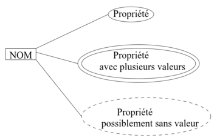

$\underline{\text{Exemple}}$

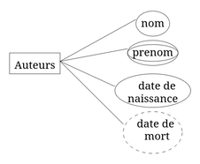

Chaque entité doit pouvoir être identifiée de manière __unique__ au sein du type auquel elle appartient.

Si nécessaire on peut ajouter une propriété à cet effet.

> __Def__
>
> - Une __association__ représente un lein entre différentes entités.
> Une association peut aussi avoir des propriétés.
> - Un __type assiciation__ regroupe des associations reliant des entités appartenant au même type-entité et ayant les même propriétés.

$\underline{\text{Représentation Graphique d'un type entité}}$

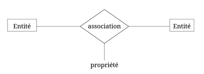

$\underline{\text{Exemple}}$

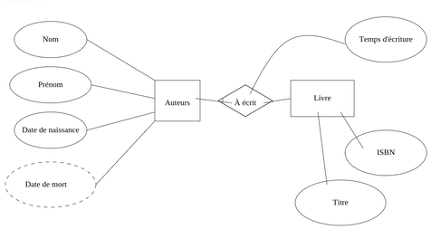

$\to$ Pour être stocké, tout type-association doit être __binaire__ (relier 2 types-entités).

> __Idée__: transformer le type-association en un type-entité et recréer des types-associations pour tout relier.

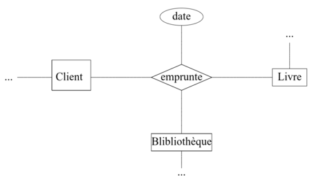

Devient :

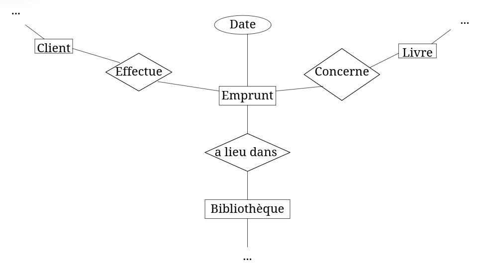

Tous les types associations sont aussi binaires.

> __Définition__:
>
> Chaque type-entité participant à un type-association a une contrainte de cardinalité : couple $(\text{min}, \text{max})$ qui représente le nombre minimum/maximum de fois qu'une entité du type-entité peut participer au type association.
>
> La __cardinalité__ d'un type-association est le $\text{max} {\scriptsize 1} - \text{max} {\scriptsize 2}$ des contraites de cardinalité des 2 types-entité.

$\underline{\text{Exemple}}$

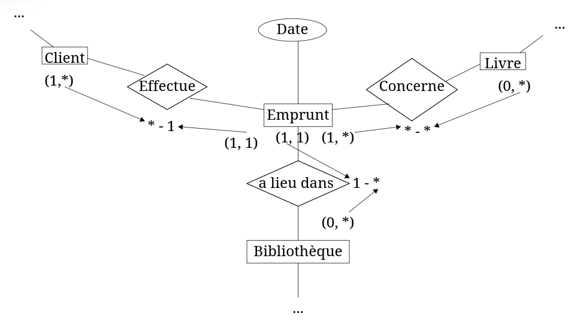

- Cardinalités usuelles:
  1) $1-1$ (one to one)
  2) $1- \star$ (one to many)
  3) $\star - \star$ (many to many)

⚠️ Les types-associations de cardinalité $\star - \star$ doivent être transformés en 2 types-associations $1- \star$ en transformant le type-association en type-entité.

$\underline{\text{Exemple}}$

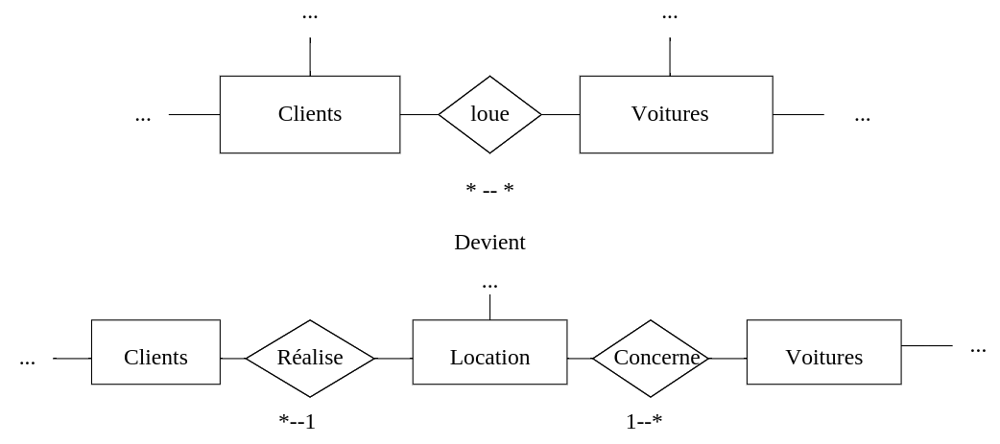

- $\underline{\textbf{1ère étape de conception d'une base:}}$
  - dessiner les types-entités et leurs propriétés.
  - dessiner les types-association et leurs propriétés.
  - binariser les types-associations si nécessaire.
  - transformer les types-associations $\star - \star$ en 2 $(1- \star)$ .

$\to$ Modèle entité-association = point de vue utilisateur.

$\to$ Structure de données internes = point de vue SGBD.

### 3. Modèle relationnel

> __Vocabulaire__:
>
> - *relations* (tableau à 2 dimensions)
> - *attributs* (colonnes)
> - *domaine* (type (INT/REEL/TEXT), info supplémentaires de format, possibilité de ne pas être renseigné (NULL)).
> - *Enregistrement* (lignes)
> - *clés primaires* = attribut (ou groupe d'attribut) d'une relation que fait respecter la contrainte d'unicité.
> - *clés étrangères* = attrivu (ou groupe d'attributs) d'une relation qui fait référence (va chercher ses valeus) à la clé primaire d'autre relation, fait respecter la contrainte de référence
> - *Schéma relationnel*: contient relations, attributs, clés primaires et étrangères qui constituent.

- $\underline{\textbf{2ème étape de conception d'une base de données:}}$
  
  - transformer le modèe entite-association en un chéma relationnel interprétable par le SGBD.
  
  - Chaque type-entité devient une relation.
  
  - Les propriétés des types-entités deviennent des attributs.
  
  -  = un attribut, non NULL
  
  -  = un attribut, peut-être NULL
  
  -  = plusieurs attributs ou 1 dont le domaine précise l'organisation
  
  - La construction de type-entité garantit déja la présence d'un ou plusieurs attibuts pour constituer une clé primaire.
  
  - chaque type-association devient une clé étrangère, placée dans la relation ayant donné le " $1$ " à la cardinalité qui fait référence à la relation ayant donnée le " $*$ " .

$\underline{\text{Exemple}}$

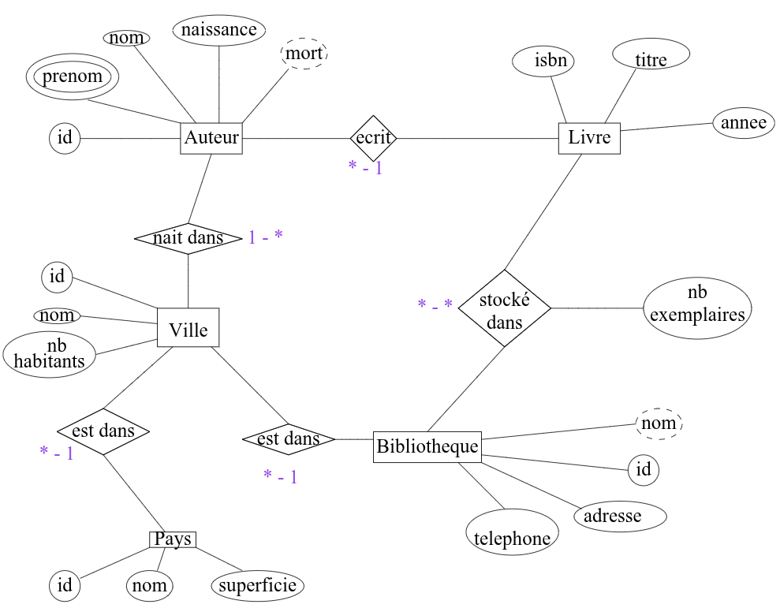

$$
\text{Légende :}
\begin{cases}
\textbf{Gras} = \text{clé primaire} \\
\rightarrow \space  = \text{clé étrangère}
\end{cases}
$$

- Pays (__id__, nom, superficie)

- Ville (__id__, nom, nb_habitants, id_pays $\rightarrow$ Pays.id)

- Auteur (__id__, nom, prenom, naissance, mort, id_ville $\rightarrow$ Ville.id)

- Bibliotheque (__id__, nom, adresse, téléphone, id_ville $\rightarrow$ Ville.
id)

- Livre (__isbn__, titre , annee, id_auteur $\rightarrow$ Auteur.id)

- Inventaire (__id__, nb_exemplaires, isbn_livre $\rightarrow$ Livre.isbn, id_biblio $\rightarrow$ Bibliotheque.id)

## II. Requêtes SQL

*Bonnes pratiques* de syntaxe:

- Commentaires : `--`
- MOTS-CLEFS
- Relation
- attribut
- retour à la ligne fréquent

On introduit :

$\underline{\text{Relation 1}}$

|$\underline{\textbf{a}}$|b|c $\to \text{Relation2.d}$|
|:-:|:-:|:-:|
|x|1|rouge|
|y|5|bleu|
|z|3|rouge|
|t|4|vert|
|u|1|turquoise|

$\underline{\text{Relation 2}}$

|$\underline{\textbf{d}}$|e|
|:-:|:-:|
|rouge|s|
|bleu|t|
|vert|t|

Les mots clefs en SQL sont alors :

### 1. Projection

```SQL
SELECT ...
FROM ...
```

- `DISTINCT()`
- tous les attributs : `*`
- Opérateurs arithmétiques (sur INTEGER ou REAL) `+`, `-`, `/`, `*`, `%` et `ABS()`
- Opérateurs sur TEXT `||` (concaténation), `UPPER()`, `LOWER()` et `LENGTH()`

$\underline{\text{Ex}}$

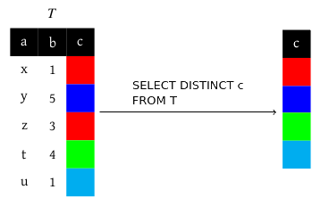

### 2. Formatage

- `ORDER BY` avec `ASC` pour l'ordre croissant et `DESC` pour décroissant
- `AS` ou alias
- `LIMIT n` n'a aucun sens sans utiliser `ORDER BY`
- `OFFSET m` n'est utilisable qu'avec `LIMIT`

$\underline{\text{Ex}}$

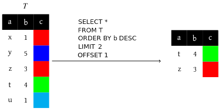

### 3. Opérations ensemblistes

- `.. UNION ..`
- `.. INTERSECT ..`
- `.. EXCEPT ..`
- ⚠️ mêmes nb de colonnes et même domaines pour les colonnes correspondantes pour les 2 requêtes

$\to$ le résultat n'a jamais de doublons (c'est un ensemble).

$\underline{\text{Ex}}$

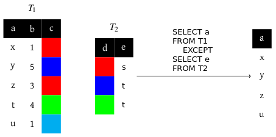

- Produit cartésien :

```SQL
SELECT ...
FROM Relation1, Relation2, ...
```

$\underline{\text{Ex}}$

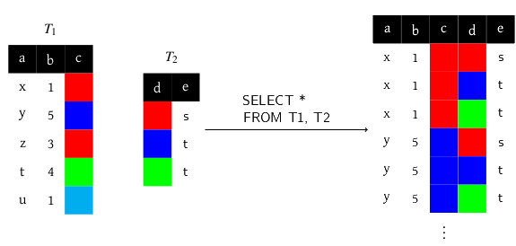
(il y a 15 lignes dans le résultat de cette requête)

### 4. Les séléction (ou filtrer les enregistrement)

- `WHERE`
- Opérateur de comparaison, `=`, `<>`, `<`, `>`, `<=` et `>=`
- `IS NULL` / `IS NOT NULL`
- `LIKE` avec `%` pour n'importe quoi et `_` pour un seul caractère
- `AND`, `OR` et `NOT`

$\underline{\text{Ex}}$

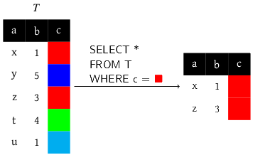

### 5. Jointures

- Permettent de récupérer des données répaties dans plusieurs relations. Dans ce cas on utilise les clés étrangères. Les jointures peuvent s'enchainer.

```SQL
SELECT ...
FROM Relation1
JOIN Relation2
  ON Relation1.cle_etrangere = Relation2.cle_primaire
```

$\underline{\text{Ex}}$

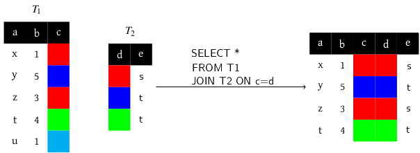

- Jointures externes `LEFT JOIN` / `RIGHT JOIN`

$\underline{\text{Ex}}$

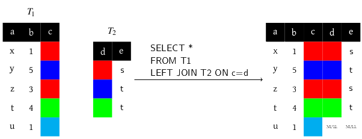

- Autojointures

$\underline{\text{Ex}}$

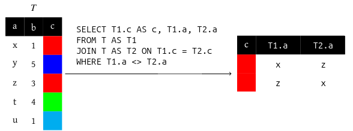

### 6. Fonctions d'agrégation

- La requête est effectuée comme s'il n'y avait pas la fonction, puis toutes les lignes sont rassemblées pour faire le calcul demandé.
- `MIN()`
- `MAX()`
- `SUM()`
- `AVG()`
- `COUNT()`

$\underline{\text{Exemples :}}$

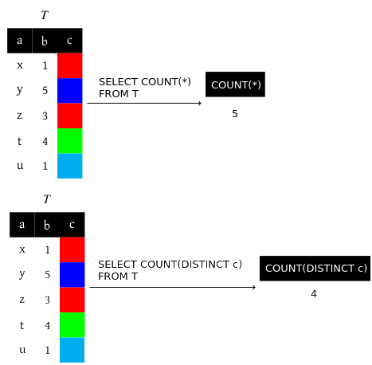

### 7. Regroupement et filtrage des agrégats

```SQL
GROUP BY attribut1, attribut2, ..
HAVING condition sur le groupe
-- WHERE agit avant que les groupes ne soient faits et HAVING après
```

-Les fonctions d'agrégation s'apppliquent à tous les enregistrement d'un même groupe.

$\underline{\text{Exemples}}$

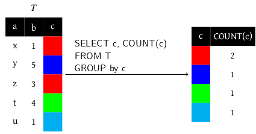

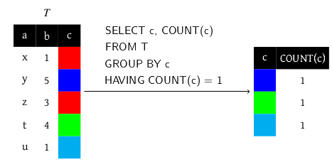

```SQL
-- Une requête du style :
SELECT a
FROM Relation1
GROUP BY b
-- n'a aucun sens
-- en effet on a regrouper selon les valeur de b
-- donc on ne sait pas quelle valeur de a on va avoir 
-- (en particulier pour b = 1)
```

$\underline{\text{Ex}}$

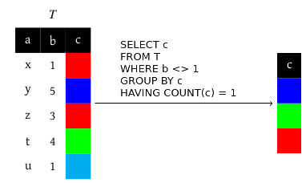

### 8. Requêtes imbriquées

- s'écrit avec des `()`
- permet de trouver des données intérmédiaires et les utiliser dans la requête principale.

$\underline{\text{Exemples}}$

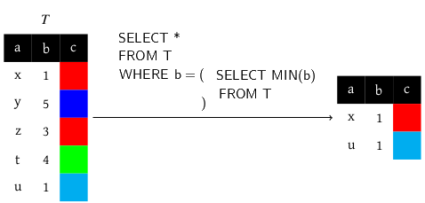

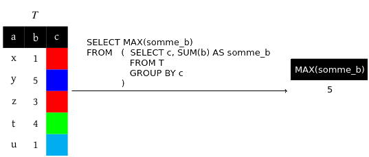

### Conclusion

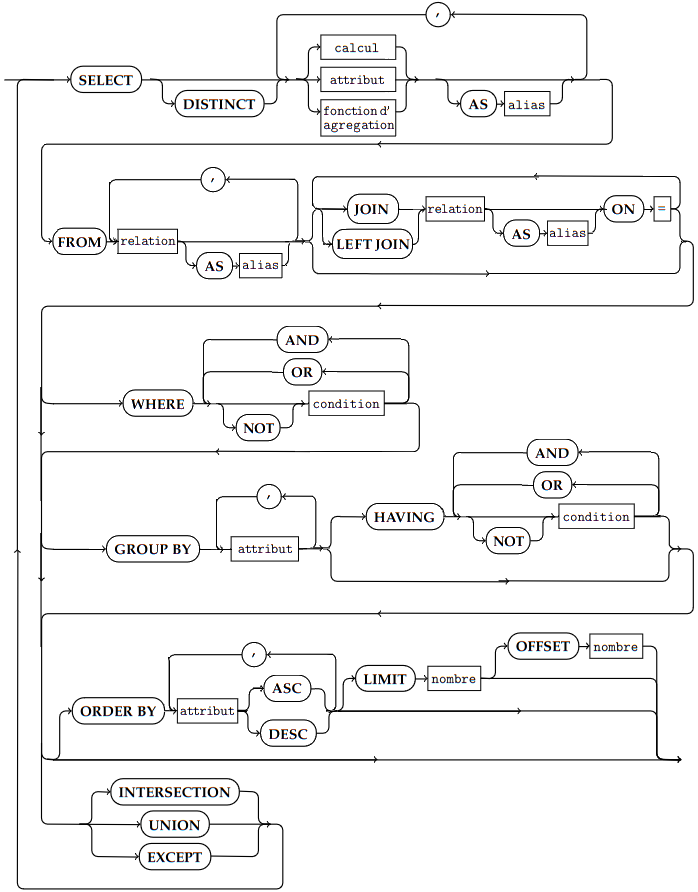
