# Chapitre 15: Structure à l'aide d'arbres binaires

- $\underline{\text{Objectif :}}$ Étudier 2 manières d'organiser les étiquettes d'un arbre binaire pour :
  - réaliser certaines opérations effeicacement
  - implementer certaines structures de donnés abstraites

## I. Arbres binaires de recherche (ABR)

### 1. ABR simples

#### a) Définition

$\underline{\text{Idée :}}$ l'étiquette de chaque noeud de l'abre binaire doit être supérieur à toutes celles de son sous-arbre gauche et inférieur à toutes celles du droit.

$\underline{\text{Exemples}}$

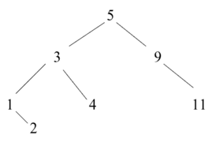 est un ABR

> __Définition inductive des ABR__
>
> Soit $(E, <)$ un ensemble totalement ordonné (étiquettes.)
>
> - Assertion : $\bot$ (arbre vide) est un ABR
> - Règle d'inférence : Soit $e \in E$ et $g$ et $d$ deux ABR tels que $sup\{\text{étiquettes de g}\} \leq e \leq inf\{\text{étiquettes de d}\}$ alors 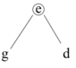 notée $N(e, g, d)$ est un ABR

- __Théorème__ Un arbre binaire est un ABR $\iff$ son parcours en ordre infixe est croissant.
  - Preuve par induction structurelle
    - Assertion : trivial

    - Règle d'inférence
      - sens $\implies$ : Soit $N(e, g, d)$ un ABR avec $g$ et $d$ vérifiant l'hypothèse. Le parcours infixe de N(e, g, d) contient :
        - le parcours de $g$ croissant par hypothèse d'induction.
        - l'étiquette $e$.
        - le parcours de $d$ croissant par hypothèse d'induction.
      - De plus, d'après la définition : $sup\{\text{étiquettes de g}\} \leq e \leq inf\{\text{étiquettes de d}\}$ donc le parcours de $N(e, g, d)$ est croissant.
      - sens $\impliedby$: Soit $\text{P{\scriptsize g} e P{\scriptsize d}}$ le parcours infixe d'un arbre binaire, avec $P{\scriptsize g}$ le parcours de son sous arbre gauche $g$ et $P{\scriptsize d}$ le parcours de son sous arbre droit $d$, tel que $\text{P{\scriptsize g} e P{\scriptsize d}}$ soit croissant. L'arbre $g$ de parcours $P{\scriptsize g}$ est un ABR par hypothèse d'induction. De même pour $d$. Et comme $\text{P{\scriptsize g} e P{\scriptsize d}}$ est croissant on a bien l'inégalité de la définition. Donc $N(e, g, d)$ est un ABR

#### b) opération élémentaires

$\underline{\textbf{Recherche d'un étiquette dans un ABR}}$

$\underline{\text{Exemple}}$ Recherche de 1 (en rouge) et de 12 (en bleu) dans

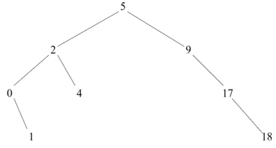

alors : 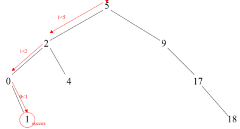

et on a : 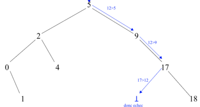

> __Définition__ inductive de la recherche de $x$ dans un ABR $a$, notée $rec(x,a)$
>
> - Assertion : $rec(x, \bot) = \text{Faux}$
> - régle d'inférence
>
> $$ rec(x, N(e,g,d)) = \begin{align*} &\text{Vrai} \space \text{si} \space e = x \\ &rec(x, g) \space \text{si} \space x<e \\ &rec(x, d) \space \text{sinon} \end{align*}$$

- Complexité: $C {\scriptsize a}$ complexité de $rec(x, a)$ dans le pire des cas.
  - $$\begin{align*} &C {\scriptsize \bot} = O(1) \\ &C {\scriptsize N(e, g, d)} = \begin{align*} &O(1) + C {\scriptsize g} \space \text{si} \space x<e \\ &O(1) + C {\scriptsize d} \space \text{si} \space x>e \end{align*} \end{align*}$$
  - donc $C {\scriptsize N(e, g, d)} \leq O(1) + max(C {\scriptsize g}, C {\scriptsize d})$ . Donc $C {\scriptsize a} = O(\text{hauteur de a})$  en supposant les comparaisons en $O(1)$ (on fera toujours cette supposition).
  - Rappel : dans le meilleur des cas (ABR complet) cette complexité revient à $\log (\text{taille de a})$ et dans le pire des cas (filiforme) elle revient à linéaire en la taille de a.

$\underline{\textbf{Trouver le minimum ou le maximum d'un abr}}$

$\underline{\text{Exemple}}$

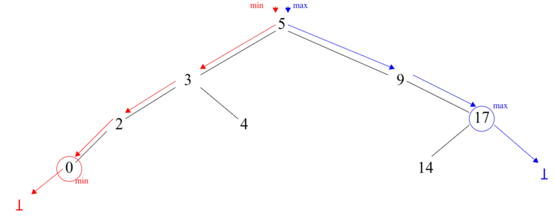

> __Définition__ inductive du minimum d'un ABR $a$, notée $min(a)$
>
> - Assertion : $min(\bot) = \text{non défini}$
> - régle d'inférence
>
> $$ min(N(e,g,d)) = \begin{align*} &e \space \text{si} \space g = \bot \\ &min(g) \space \text{sinon} \end{align*}$$

- Complexité: $C {\scriptsize a}$ complexité de $min(a)$ dans le pire des cas.
  - $$\begin{align*} &C {\scriptsize \bot} = O(1) \\ &C {\scriptsize N(e, g, d)} = O(1) + C {\scriptsize g} \end{align*}$$
  - donc $C {\scriptsize N(e, g, d)} \leq O(1) + max(C {\scriptsize g}, C {\scriptsize d})$ . Donc $C {\scriptsize a} = O(\text{hauteur de a})$ .

$\underline{\textbf{Insetion dans un ABR}}$

On insère touours une feuille. Pour trouver où insérer même principe que la recherche.

$\underline{\text{Exemple}}$

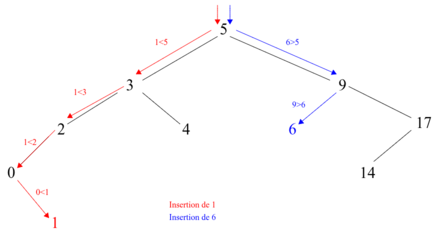

> __Définition__ inductive de l'insertion dans un ABR $a$, notée $ins(x, a)$
>
> - Assertion : $ins(x, \bot) = N(x, \bot,  \bot)$
> - régle d'inférence
>
> $$ ins(x, N(e,g,d)) = \begin{align*} &N(e, g, d) \space \text{si} \space e = x \\ &N(e, ins(x,g), d) \space \text{si} \space x < e \\ &N(e, g, ins(x,d)) \space \text{sinon} \end{align*}$$

- Complexité: $C {\scriptsize a} = O(\text{hauteur de a})$ .

$\underline{\text{Suppression d'une étiquette d'un ABR}}$

Plusieurs méthodes de suppression, on en verra 2 :

- __1. méthode de la fusion__

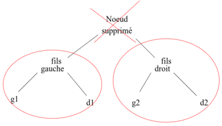

la fusion du sous-arbre gauche et du sous-arbre droit du noeud supprimé va donner.

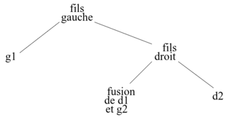

- $Fusion(N(f{\scriptsize g}, g{\scriptsize 1}, d{\scriptsize 1}), N(f{\scriptsize d}, g{\scriptsize 2}, d{\scriptsize 2})) = N(f{\scriptsize g}, N(f{\scriptsize d}, Fusion(d{\scriptsize 1}, g{\scriptsize 2}), d{\scriptsize 2}))$
- $Fusion(\bot, N(e, g, d)) = N(e, g, d)$
- $Fusion(N(e, g, d), \bot) = N(e, g, d)$
- $Fusion(\bot, \bot) = \bot$

> __Définition__ inductive de la suppression dans un ABR $a$, notée $supp(x, a)$
>
> On suppose l'abre sans doublons et si l'étiquette $x \notin a$ on ne fait rien.
>
> - Assertion : $supp(x, \bot) = \bot$
> - régle d'inférence
>
> $$ supp(x, N(e,g,d)) = \begin{align*} &Fusion(g, d) \space \text{si} \space e = x \\ &N(e, supp(x,g), d) \space \text{si} \space x < e \\ &N(e, g, supp(x,d)) \space \text{sinon} \end{align*}$$

- __2. Méthode de remontée d'un extremum__

$\underline{\text{Exemple}}$

Si on enlève le minimum du fils droit :

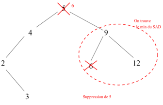

Si on enlève le maximum du fils gauche :

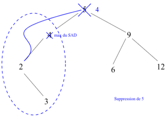

$\underline{\text{Principe}}$ recherche du noeud à supprimer puis recherche du (minimum de son SAD / maximum de son SAG) appelé $m$, puis on remplace l'étiquette à supprimer par $m$ et on supprime $m$ .

> __Définition__ inductive de la suppression dans un ABR $a$, notée $supp(x, a)$
>
> On suppose l'abre sans doublons et si l'étiquette $x \notin a$ on ne fait rien.
>
> - Assertion : $supp(x, \bot) = \bot$
> - régle d'inférence
>
> $$ supp(x, N(e,g,d)) = \begin{align*} &\bot \space \text{si} \space e = x \space \text{et} \space g = d = \bot \\ &g \space \text{si} \space e = x \space \text{et} \space d = \bot \\ &d \space \text{si} \space e = x \space \text{et} \space g = \bot \\ &N(mini(d), g, supp(mini(d), d)) \space \text{si} \space e = x  \space \text{et} \space g \neq \bot \space \text{et} \space d \neq \bot \\ &N(e, supp(x,g), d) \space \text{si} \space x < e \\ &N(e, g, supp(x,d)) \space \text{sinon} \end{align*}$$
