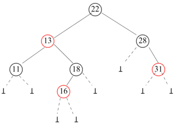
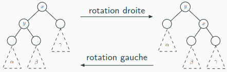
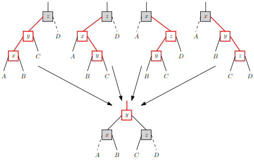
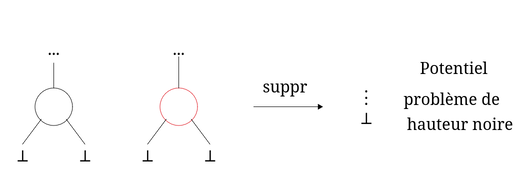
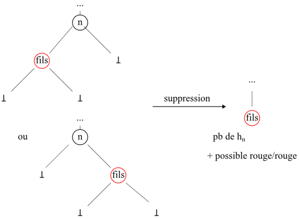
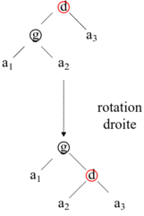
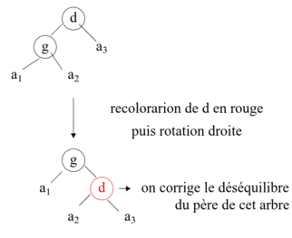
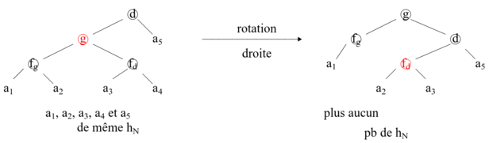
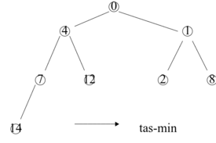
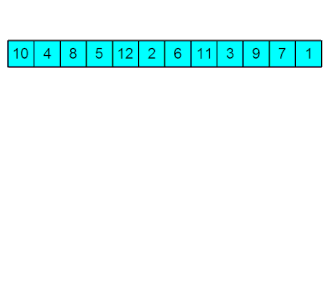

# Chapitre 15: Structure à l'aide d'arbres binaires

- $\underline{\text{Objectif :}}$ Étudier 2 manières d'organiser les étiquettes d'un arbre binaire pour :
  - réaliser certaines opérations effeicacement
  - implementer certaines structures de donnés abstraites

## I. Arbres binaires de recherche (ABR)

### 1. ABR simples

#### a) Définition ABR

$\underline{\text{Idée :}}$ l'étiquette de chaque noeud de l'abre binaire doit être supérieur à toutes celles de son sous-arbre gauche et inférieur à toutes celles du droit.

$\underline{\text{Exemple}}$

 est un ABR

> __Définition inductive des ABR__
>
> Soit $(E, <)$ un ensemble totalement ordonné (étiquettes.)
>
> - Assertion : $\bot$ (arbre vide) est un ABR
> - Règle d'inférence : Soit $e \in E$ et $g$ et $d$ deux ABR tels que $sup\{\text{étiquettes de g}\} \leq e \leq inf\{\text{étiquettes de d}\}$ alors  notée $N(e, g, d)$ est un ABR

- __Théorème__ Un arbre binaire est un ABR $\iff$ son parcours en ordre infixe est croissant.
  - Preuve par induction structurelle
    - Assertion : trivial

    - Règle d'inférence
      - sens $\implies$ : Soit $N(e, g, d)$ un ABR avec $g$ et $d$ vérifiant l'hypothèse. Le parcours infixe de N(e, g, d) contient :
        - le parcours de $g$ croissant par hypothèse d'induction.
        - l'étiquette $e$.
        - le parcours de $d$ croissant par hypothèse d'induction.
      - De plus, d'après la définition : $sup\{\text{étiquettes de g}\} \leq e \leq inf\{\text{étiquettes de d}\}$ donc le parcours de $N(e, g, d)$ est croissant.
      - sens $\impliedby$: Soit $\text{P{\scriptsize g} e P{\scriptsize d}}$ le parcours infixe d'un arbre binaire, avec $P{\scriptsize g}$ le parcours de son sous arbre gauche $g$ et $P{\scriptsize d}$ le parcours de son sous arbre droit $d$, tel que $\text{P{\scriptsize g} e P{\scriptsize d}}$ soit croissant. L'arbre $g$ de parcours $P{\scriptsize g}$ est un ABR par hypothèse d'induction. De même pour $d$. Et comme $\text{P{\scriptsize g} e P{\scriptsize d}}$ est croissant on a bien l'inégalité de la définition. Donc $N(e, g, d)$ est un ABR

#### b) Opération élémentaires

$\underline{\textbf{Recherche d'un étiquette dans un ABR}}$

$\underline{\text{Exemple}}$ Recherche de 1 (en rouge) et de 12 (en bleu) dans


alors : 

et on a : 

> __Définition__ inductive de la recherche de $x$ dans un ABR $a$, notée $rec(x,a)$
>
> - Assertion : $rec(x, \bot) = \text{Faux}$
> - régle d'inférence
>
> $$rec(x, N(e,g,d)) = \begin{align*} &\text{Vrai} \space \text{si} \space e = x \\ &rec(x, g) \space \text{si} \space x<e \\ &rec(x, d) \space \text{sinon} \end{align*}$$

- Complexité: $C {\scriptsize a}$ complexité de $rec(x, a)$ dans le pire des cas.
  - $$\begin{align*} &C {\scriptsize \bot} = O(1) \\ &C {\scriptsize N(e, g, d)} = \begin{align*} &O(1) + C {\scriptsize g} \space \text{si} \space x<e \\ &O(1) + C {\scriptsize d} \space \text{si} \space x>e \end{align*} \end{align*}$$
  - donc $C {\scriptsize N(e, g, d)} \leq O(1) + max(C {\scriptsize g}, C {\scriptsize d})$ . Donc $C {\scriptsize a} = O(\text{hauteur de a})$  en supposant les comparaisons en $O(1)$ (on fera toujours cette supposition).
  - Rappel : dans le meilleur des cas (ABR complet) cette complexité revient à $\log (\text{taille de a})$ et dans le pire des cas (filiforme) elle revient à linéaire en la taille de a.

$\underline{\textbf{Trouver le minimum ou le maximum d'un abr}}$

$\underline{\text{Exemple}}$


> __Définition__ inductive du minimum d'un ABR $a$, notée $min(a)$
>
> - Assertion : $min(\bot) = \text{non défini}$
> - régle d'inférence
>
> $$ min(N(e,g,d)) = \begin{align*} &e \space \text{si} \space g = \bot \\ &min(g) \space \text{sinon} \end{align*}$$

- Complexité: $C {\scriptsize a}$ complexité de $min(a)$ dans le pire des cas.
  - $$\begin{align*} &C {\scriptsize \bot} = O(1) \\ &C {\scriptsize N(e, g, d)} = O(1) + C {\scriptsize g} \end{align*}$$
  - donc $C {\scriptsize N(e, g, d)} \leq O(1) + max(C {\scriptsize g}, C {\scriptsize d})$ . Donc $C {\scriptsize a} = O(\text{hauteur de a})$ .

$\underline{\textbf{Insetion dans un ABR}}$

On insère touours une feuille. Pour trouver où insérer même principe que la recherche.

$\underline{\text{Exemple}}$


> __Définition__ inductive de l'insertion dans un ABR $a$, notée $ins(x, a)$
>
> - Assertion : $ins(x, \bot) = N(x, \bot,  \bot)$
> - régle d'inférence
>
> $$ ins(x, N(e,g,d)) = \begin{align*} &N(e, g, d) \space \text{si} \space e = x \\ &N(e, ins(x,g), d) \space \text{si} \space x < e \\ &N(e, g, ins(x,d)) \space \text{sinon} \end{align*}$$

- Complexité: $C {\scriptsize a} = O(\text{hauteur de a})$ .

$\underline{\text{Suppression d'une étiquette d'un ABR}}$

Plusieurs méthodes de suppression, on en verra 2 :

- __1. méthode de la fusion__


la fusion du sous-arbre gauche et du sous-arbre droit du noeud supprimé va donner.


- $Fusion(N(f{\scriptsize g}, g{\scriptsize 1}, d{\scriptsize 1}), N(f{\scriptsize d}, g{\scriptsize 2}, d{\scriptsize 2})) = N(f{\scriptsize g}, N(f{\scriptsize d}, Fusion(d{\scriptsize 1}, g{\scriptsize 2}), d{\scriptsize 2}))$
- $Fusion(\bot, N(e, g, d)) = N(e, g, d)$
- $Fusion(N(e, g, d), \bot) = N(e, g, d)$
- $Fusion(\bot, \bot) = \bot$

> __Définition__ inductive de la suppression dans un ABR $a$, notée $supp(x, a)$
>
> On suppose l'abre sans doublons et si l'étiquette $x \notin a$ on ne fait rien.
>
> - Assertion : $supp(x, \bot) = \bot$
> - régle d'inférence
>
> $$ supp(x, N(e,g,d)) = \begin{align*} &Fusion(g, d) \space \text{si} \space e = x \\ &N(e, supp(x,g), d) \space \text{si} \space x < e \\ &N(e, g, supp(x,d)) \space \text{sinon} \end{align*}$$

- __2. Méthode de remontée d'un extremum__

$\underline{\text{Exemple}}$

Si on enlève le minimum du fils droit :


Si on enlève le maximum du fils gauche :


$\underline{\text{Principe}}$ recherche du noeud à supprimer puis recherche du (minimum de son SAD / maximum de son SAG) appelé $m$, puis on remplace l'étiquette à supprimer par $m$ et on supprime $m$ .

> __Définition__ inductive de la suppression dans un ABR $a$, notée $supp(x, a)$
>
> On suppose l'abre sans doublons et si l'étiquette $x \notin a$ on ne fait rien.
>
> - Assertion : $supp(x, \bot) = \bot$
> - régle d'inférence
>
> $$ supp(x, N(e,g,d)) = \begin{align*} &\bot \space \text{si} \space e = x \space \text{et} \space g = d = \bot \\ &g \space \text{si} \space e = x \space \text{et} \space d = \bot \\ &d \space \text{si} \space e = x \space \text{et} \space g = \bot \\ &N(mini(d), g, supp(mini(d), d)) \space \text{si} \space e = x  \space \text{et} \space g \neq \bot \space \text{et} \space d \neq \bot \\ &N(e, supp(x,g), d) \space \text{si} \space x < e \\ &N(e, g, supp(x,d)) \space \text{sinon} \end{align*}$$

#### c) Interêt des ABR

- Structure abstraite qu'on peut implémenter via un ABR:
  - ensemble
    - création : renvoie $\bot$ donc $O(1)$
    - ajout d'un élement : insertion dans l'ABR donc $O(\text{hauteur de l'ABR})$
    - suppression d'un élement : suppression d'un noeud $O(\text{hauteur de l'ABR})$
    - recherche de présence d'un élement : recherche dans un ABR $O(\text{hauteur de l'ABR})$
  
  - tableaux associatifs : on stocke les associations dans un ABR les clés vérifient les propriétes des ABR. On retrouve les opérations :
    - création : renvoie $\bot$ donc $O(1)$
    - ajout d'une association : insertion dans l'ABR donc $O(\text{hauteur de l'ABR})$
    - suppression d'une association : suppression d'un noeud $O(\text{hauteur de l'ABR})$
    - recherche d'une valeur depuis la clé : recherche dans un ABR $O(\text{hauteur de l'ABR})$
    - test de présence (idem qu'au dessus)

$\underline{\text{Rmq :}}$

- L'autre implémentation possible d'un TA par une table de hachage donnait des complexités en $O(1)$ amortie à condition que plusieurs contraintes soient respectées. Parfois si ces contraintes sont difficiles à respecter une implémentation via un ABR peut être préférable.

> Un arbre est dit __équilibré__ si $h(A) = O(\log(T(A)))$ avec $h$ la hauteur et $t$ la taille.

Pour être efficace les ABR devrait être équilibrés.

### 2. Arbres bicolores

#### a) Définition ARN

> Un __arbre bicolore__ (ARN) est un ABR dont chaque noeud est rouge ou noir en respectant :
>
> - racine noire
> - tout noeud rouge n'a pas de fils rouge
> - tout les chemins de la racine à un $\bot$ ont le même nombre de nouds noirs

$\underline{\text{Exemple}}$



> __Définition__ La hauteure noire $h{\scriptsize N}(a)$ d'un arbre bicolore $a$ est le nombre de noeuds noirs sur le chemin de la racine de a aux $\bot$ .

- __Proposition__ Soit $a$ un arbre bicolore $h(a) \leq 2 \times h{\scriptsize N}(a)$
  - Preuve : Le plus long chemin de la racine a un $\bot$ contient au pire une fois sur 2 un noeud noir et une fois sur 2 un noeud rouge, donc on a $h{\scriptsize N}(a)$ noeuds noirs et $h{\scriptsize N}(a)$ noeuds rouges.

- __Proposition__ Soit $a$ une arbre bicolore $t(a) \geq 2^{h{\scriptsize N}(a)} - 1$
  - Preuve : Par récurrence forte sur la taille.
    - Initialisation : Un arbre à $0$ noeud est de hauteur noire $0$ or $0 \geq 2^0 - 1$
    - Héredité : Prenons $a = N(e, g, d)$ un arbre bicolore avec $t(a) \geq 1$ en supposant la proposition vraie pour les arbres bicolores de taille $< t(a)$. On a $t(a) = 1 + t(g) + t(d)$ . Considérons $g$ :
      - Si $g$ est un arbre bicolore par HR $t(g) \geq 2^{h{\scriptsize N}(g)} -1$
      - Sinon le seul critère non respecté est la couleur de la racine. Considérons $g'$ copie de $g$ mais de racine noire. par HR. $t(g) = t(g') \geq 2^{h{\scriptsize N}(g')} -1$ donc $t(g) \geq 2^{h{\scriptsize N}(g) + 1} -1 \geq 2^{h{\scriptsize N}(g)} -1$
    - De même pour l'arbre $d$. Donc dans tous les cas $t(a) \geq 1 + 2^{h{\scriptsize N}(d)} -1 + 2^{h{\scriptsize N}(g)} -1$ or $2^{h{\scriptsize N}(d)} + 2^{h{\scriptsize N}(g)} -1 = 2\times 2^{h{\scriptsize N}(d)} -1 = 2^{h{\scriptsize N}(a)} -1$ car ${h{\scriptsize N}(d)} = {h{\scriptsize N}(g)}$ .

- __Théorème__ Les arbres bicolores sont toujours équilibrés.
  - Preuve : Soit $a$ un arbre bicolore
    - $t(a) \geq 2^{h{\scriptsize N}(a)} - 1$
    - $\frac{1}{2} h(a) \leq h{\scriptsize N}(a)$
  - En combinant les 2 propriétés cela donne $h(a) \leq 2 \times \log{\scriptsize 2}(t(a) + 1)$ donc $h(a) = O(\log (t(a)))$ .

#### b) Opérations sur les ARN

$\underline{\textbf{Recherche}}$ : exactement la même chose que les ABR.

- Complexité en $O(\text{hauteur}) = O(\log(\text{taille}))$

$\underline{\textbf{Rotations}}$ : les insertions et suppressions sont basées sur les rotations



Une rotation préserve les prop des ABR.

- Complexité en $O(1)$ .

$\underline{\textbf{Insertion}}$ : On insère une feuille comme pour les ABR, de couleur __rouge__.

On peut avoir crée un conflit rouge/rouge. Dans ce cas le père de la feuille est rouge et son père à lui est noir.



On corrige récursivement tous les conflits rouge/rouge. Si nécessaire à la fin on remet la racine en noir.

- Complexité : $O(\text{hauteur}) = O(\log(\text{taille}))$

$\underline{\textbf{Suppression}}$

S'effectue de la même manière que dans un ABR avec la méthode de remonté d'un maximum

Soit $n$ le noeud à supprimer.

- Si $n$ a $0$ fils



- Si $n$ a $1$ fils



- Si $n$ a $2$ fils l'étiquette est remplacé par le max du SAG ou le min du SAD. Ce max ou ce min a $0$ ou $1$ fils donc on es dans le cas précedent.

On procède alors dans cette ordre :

1. Suppression sans s'occuper es couleurs (comme un ABR)
2. correction des pb de hauteur noire
3. correction des conflits rouge/rouge (comme dans l'insertion)
4. on remet la racine à noire si nécessaire

Si on a un pb de hauteure noire, le noeud $d$ déséquilibré a un SAG de $h {\scriptsize N}$ supérieure/inférieure de $1$ par rapport à la $h {\scriptsize N}$ du SAD. Considérons le cas où $h {\scriptsize N}(SAG)$ est supérieure d'un par rapport à $h {\scriptsize N}(SAD)$. Toutes les corrections sont basées sur une rotation droite et recolotation de certains noeuds.

Si $a {\scriptsize 1}$, $a {\scriptsize 2}$ et $a {\scriptsize 3}$ ont la même hauteur noire.

- 1er cas possible



- 2eme cas possible



- 3eme cas possible



- Complexité de la suppression : $O(\text{hauteur}) = O(\log(\text{taille}))$ .

## II. Tas

### 1. Definition

> Soit $(E, \prec)$ un ensemble totalement ordonné.
>
> Un tas est un arbre binaire __complet à gauche__ et qui respecte __la relation d'ordre des tas__, c'est à dire c'est-à-dire que tout noeud $y$ de fils $x$ doit respecter $x \preceq y$ .

$\underline{\text{Exemple}}$

 est un tas dont les étiquettes sont dans $(\mathbb{N}, \leq)$

On obsèrve 2 types de tas particuliers

1. Tas-min sont des tas sur $(\mathbb{N}, \leq)$
2. Tas-max sont des tas sur $(\mathbb{N}, \geq)$

- __Propriétés imméduates__
  - Les tas sont équilibrés ($\text{hauteur} = O(\log(\text{taille}))$)
  - La racine d'un tas-min est le minimum des étiquettes.
  - La racine d'un tas-max est le maximum des étiquettes.
  - chaque ancêtre $a$ d'un noeud $n$ respecte $a \preceq n$ et chaque descendant $d$ d'un noeud respecte $d \succeq n$

$\to$ les tas sont stockés dans des tableaux. Quelques rappels.

- la racine est d'indice 0.
- un noeud à l'indice $i$,
  - son fils gauche est à l'indice $2i + 1$
  - son fils droit est à l'indice $2i + 2$
  - son père est à l'indice $\lfloor \frac{i-1}{2} \rfloor$
- l'ordre est celui du parcours en largeur.

### 2. Opérations sur les tas (tas-max seulement)

$\underline{\textbf{Percolation}}$

Opération qui prend entrée un arbre binaire complet à gauche avecun noeud seulement qui respecte pas la propriété d'ordre des tas.

- Si la relation n'est pas respectée avec son père, on percole vers le haut.
- Si la relation n'est pas respecrée avec le fils, on percole vers le bas.

Une percolation est en $O(\text{hauteur du tas}) = O(\log(\text{taille du tas}))$

```algo
// Percolation sur un tas-max
FONCTION perco_haut(tas T, indice i)
  i_pere = partie_entière((i-1)/2)
  SI i != 0 ET T_{i_pere} < T_{i} ALORS
    ECHANGER (i, i_pere)
    PERCO_HAUT (T, i_pere)
  FIN SI
FIN FCT
```

Soit $p$ la profondeur du oeud d'indice $i$ et $C {\scriptsize p}$ la complexité dans le pire des cas.
$$
\begin{align*}
  C {\scriptsize 0} &= O(1) \\
  C {\scriptsize p} &= O(1) + C {\scriptsize p-1}
\end{align*}
$$

donc $C {\scriptsize p} = O(p)$ . Or

$$
\begin{align*}
  p &= O(\text{hauteur du tas}) \\
  &= O(\log (\text{taille}))
\end{align*}
$$

```algo
// Percolation sur un tas-max
FONCTION perco_bas(tas T, indice i, nb_elts_T)
  i_gauche <- 2i + 1
  i_droit <- 2i + 2

  SI i_droit < nb_elts_T ALORS
    i_max <- indice du max entre T_{i_gauche} et T_{idroite}
    SI T_{i} < T_{i_max} ALORS
      ECHANGER (i, i_max, nb_elts_T)
      PERCO_HAUT (T, i_max, nb_elts_T)
    FIN SI

  SINON SI i_gauche < nb_elts_T ET T_{i} < T_{i_gauche} ALORS
    ECHANGER (i, i_gauche, nb_elts_T)
  FIN SI
FIN FCT
```

$\underline{\textbf{Insertion}}$

Étapes :

1. Ajouter un feuille au seul endroit possible au seul endroit possible pour que l'arbre soit complet à gauche.
2. percoler cette feuille vers le haut.

(cf. tri par tas pour un exemple.)

$\underline{\textbf{Extraction de la racine}}$

- Complexité : $O(\log(\text{taille du tas}))$ avec raisonnement similaire.

Étapes :

1. Échanger l'étiquette de la racine avec celle de la dernière feuille, et retirer cette feuille.
2. percoler la racine vers le bas.

(cf. tri par tas pour un exemple.)

- Complexité : $O(\log(\text{taille du tas}))$ avec raisonnement similaire.

### 3. Intérêt des tas

#### a) Tri par tas

Idée:

1. transformer le tableaux en tas-max
2. extractions successives du maximum

> __Méthode pour l'étape 1:__
>
> regarder les noeuds un par un du dernier au premier et les percoler vers le bas si nécessaire.



```ALGO
TRI_PAR_TAS(tableau T de taille n) :
  POUR i ALLANT DE ⌊(n-2)/2⌋ À 0 FAIRE
    PERCOLER_BAS(T, i, n)
  FIN POUR
  POUR i ALLANT DE n-1 À 0 FAIRE
    tmp <- T[0]
    T[0] <- T[i]
    T[i] <- tmp
    PERCOLER_BAS(T, 0, i+1)
  FIN POUR
FIN FCT
```

- Varriants : $i$ pour les 2 boucles
- Invariants :
  1. Tous les arbres entacinées en un indice plus grand que $i$ sont des tas-max
  2. Les éléments du tableaux de $i$ à $n-1$ sont les plus grand éléments triées

- Complexité :
  - Spatiale :
    - $O(1)$
  - Temporelle :
    - Boucle 1:
      - Pour une profondeur $p$ (avec $0 \leq p \leq \text{hauteur(arbre)}$ ), il y a au plus $2^p$ à percoler, et la percolation sera au pire en $O(\text{hauteur(arbre)}-p)$ . En nottant $h = \text{hauteur(arbre)}$ . Donc au total, la complexité est

$$
\begin{align*}
  \sum_{p=0}^{h-1} & 2^p \times O(h-p) \\
  &= O(\sum_{i=1}^{h} 2^{h-i} \times i) \\
  &= O(2^{h}\sum_{i=1}^{h} \frac{i}{2^{i}}) \\
  &= O(2^{h})
\end{align*}
$$

- Continuité de la complexité :
  - Temporelle :
    - Boucle 2 :

$$
\begin{align*}
  \sum_{i=0}^{n-1} & O(1) + O(\log(n)) \\
  &= O(n \log(n))
\end{align*}
$$

- Total : $O(n) + O(n\log(n)) = O(n \log(n))$

#### b) Implémentation des files de priorités

Structure qui stocke des éléments associés à une __priorité__. L'extraction d'un elt renvoie celui le plus prioritaire.

- Opérations
  - créer : $\star \to$ file de priorité vide : $O(1)$
  - test_vacuité : file de priorité $\to$ booléen : $O(1)$
  - enfiler : file de priorité + elt + priorité $\to$ ajoute : $O(\log (taille))$
  - défiler : file de priorité $\to$ revoie & supprime elt le plus prioritaire : $O(\log (taille))$

Pour implementer efficacement cette structure, onstocke les élements dans un ts organisé selon les priorités.
