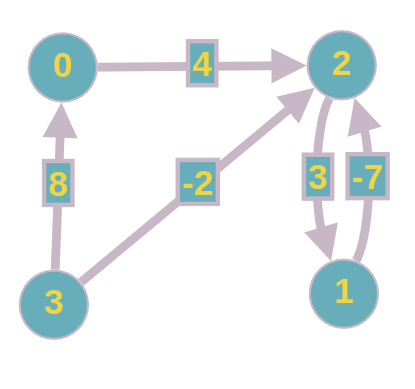
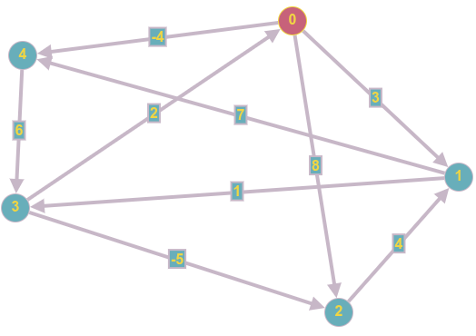
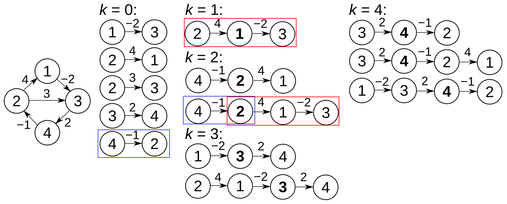
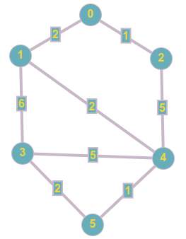

# Chapitre 16 : Distance dans un graphe pondéré

## I. Notion de pondération

- __Rappel__ Un graphe pondéré est un triplet $(S, A, \omega)$ avec
  - $S$ un ensemble non vide de sommets
  - $A$ un ensemble de couple (ordonné ou non) d'éléments différents de $S$ (i.e. un ensemble d'arrêtes/arcs)
  - $\omega : A \to \mathbb{R}$ qui à chaque arrête/arc associe un __poids__

On étend naturellement $\omega$ à tout couplede sommets. Soit $s {\scriptsize 1}, s {\scriptsize 2} \in S$ .

$$
\omega (s {\scriptsize 1), s {\scriptsize 2} ) =
\begin{align*}
    & \omega (s {\scriptsize 1} - s {\scriptsize 2}) \space \text{si} \space  s {\scriptsize 1} - s {\scriptsize 2} \in A\\
    &O \space \text{si} \space s {\scriptsize 1} = s {\scriptsize 2} \\
    & + \infty \space \text{sinon}
\end{align*}
$$

$\underline{\text{Représentations}}$

- Matrices d'adjacence:
  - Dimension $|S| \times |S|$
  - ligne $i$, colonne $j$ le coefficient est $\omega (s {\scriptsize 1}, s {\scriptsize 2})$

Exemple:

 donne

$$
\begin{pmatrix}
    0 & + \infty & 4 & + \infty \\
    + \infty & 0 & -7 & + \infty \\
    + \infty & 3 & 0 & + \infty \\
    8 & + \infty & -2 & 0
\end{pmatrix}
$$

- Listes d'adjacence
  - À chaque sommet du graphe on associe une liste de couples (voisin, poids jusqu'à voisin)

- Exemple

Avec le graphe précedent:

```lst
0 -> (2, 4)
1 -> (2, -7)
2 -> (1, 3)
3 -> (0, 8); (2, -2)
```

> __Notion de distance__
>
> Le __poids d'un chemin__ est la somme des poids desz arrêtes/arcs qui le compose
>
> La __distance__ entre deux sommets, notée $\delta (s {\scriptsize 1}, s {\scriptsize 2})$ est le poids minimal d'un chemin allant de $s {\scriptsize 1}$ à $s {\scriptsize 2}$. $\delta (s {\scriptsize 1}, s {\scriptsize 2}) = + \infty$ si aucune chemin n'existe.
>
> Un chemin de poids $\delta (s {\scriptsize 1}, s {\scriptsize 2})$ est appelé __plus court chemin__ de $s {\scriptsize 1}$ à $s {\scriptsize 2}$

- Remarque : $\delta (s {\scriptsize 1}, s {\scriptsize 2})$ peut valoir $- \infty$ si le graphe possède un cycle de poids négatif.

On s'intéresse aux problèmes suivants :

1. Calcul de la distance d'un départ fixé à une arrivée fixée.
2. Calcul des distances d'un départ fixé à tous les sommets.
3. Calcul des distances de tous les sommets à une arrivée fixé.
4. Calcul des distances de tous les sommets à tous les sommets.

Les pb 2. et 3. sont symétrique donc on les résout de la même manière.

Le pb 1. n'a pas de résolution qui ne résout pas 2. en même temps.

> __Algos__
>
> Pb 2. Dijkstra (glouton)
>
> Pb. 4 Floyd-Warshall (prog-dynamique)

## II. Algorithme de Floyd-Marshall

Précondition : Pas de cycles de poids négatif.

- Relation de récurrence
  - On note $\delta {\scriptsize k} (s {\scriptsize i}, s {\scriptsize j})$ le poids minimal d'un chemin de $(s {\scriptsize i}$ à $s {\ scriptsize j})$ dont les sommets intermédiaires sont entre $0$ et $k-1$

$$
\begin{cases}
    \delta {\scriptsize 0} (s {\scriptsize i}, s {\scriptsize j}) = \omega (s {\scriptsize i}, s {\scriptsize j}) \\
    \delta {\scriptsize k+1} (s {\scriptsize i}, s {\scriptsize j}) = min (\delta {\scriptsize k} (s {\scriptsize i}, s {\scriptsize j}), \space \delta {\scriptsize k} (s {\scriptsize i}, s {\scriptsize k}) + \delta {\scriptsize k} (s {\scriptsize k}, s {\scriptsize j}))
\end{cases}
$$

Le pb initial consiste à déterminer $\delta {\scriptsize |S|} (s {\scriptsize i}, s {\scriptsize j})$ pour tous $(s {\scriptsize i}, s {\scriptsize j}) \in S²$.

Si on veut calculer les plus courts chemins, on conserve une info en plus des distances : l'avant-dernier sommet de chaque chemin, appelé "prédécesseur" (pas le même sens que prédécesseur dans un graphe orienté).

- Pour le cas $k = 0$ , le prédécesseur des chemins de $s {\scriptsize i}$ à $s {\scriptsize j}$ est $s {\scriptsize i}$ si $s {\scriptsize i} \to s {\scriptsize j} \in A$ aucun sinon
- Pour $k+1$ si $\delta {\scriptsize k} (s {\scriptsize i}, s {\scriptsize j}) \leq \delta {\scriptsize k} (s {\scriptsize i}, s {\scriptsize k}) + \delta {\scriptsize k} (s {\scriptsize k}, s {\scriptsize j})$ alors le prédécesseur ne change pas. Sinon le prédécesseur devient le prédecesseur calculé avant le chemin allant de $s {\scriptsize k}$ à $s {\scriptsize j}$ .

On stocke les $\delta {\scriptsize k}$ (et les prédecesseurs) dans des matrices $|S| \times |S|$

Exemples :

### Exemple 1



Pour $k=0$ :

Pour $k = 0$ :

$$
\begin{align*}
    &\delta_0 \space & \text{prédécesseurs}\\
    &\begin{pmatrix}
        0 & 3 & 8 & +\infin & -4 \\
        +\infin & 0 & + \infin & 1 & 7 \\
        +\infin & 4 & 0 & +\infin & +\infin \\
        2 & +\infin & -5 & 0 & +\infin \\
        +\infin & +\infin & +\infin & 6 & 0
    \end{pmatrix}
    &\begin{pmatrix}
        \star & 0 & 0 & \star & 0 \\
        \star & \star & \star & 1 & 1 \\
        \star & 2 & \star & \star & \star \\
        3 & \star & 3 & \star & \star \\
        \star & \star & \star & 4 & \star
    \end{pmatrix}
\end{align*}
$$

Pour $k=1$ :

$$
\begin{align*}
    &\delta_1 \space & \text{prédécesseurs}\\
    &\begin{pmatrix}
        0 & 3 & 8 & +\infin & -4 \\
        +\infin & 0 & + \infin & 1 & 7 \\
        +\infin & 4 & 0 & +\infin & +\infin \\
        2 & \bf{5} & -5 & 0 & \bf{-2} \\
        +\infin & +\infin & +\infin & 6 & 0
    \end{pmatrix}
    &\begin{pmatrix}
        \star & 0 & 0 & \star & 0 \\
        \star & \star & \star & 1 & 1 \\
        \star & 2 & \star & \star & \star \\
        3 & \bf{0} & 3 & \star & \bf{0} \\
        \star & \star & \star & 4 & \star
    \end{pmatrix}
\end{align*}
$$

Pour $k = 2$ :

$$
\begin{align*}
    &\delta_2 \space & \text{prédécesseurs}\\
    &\begin{pmatrix}
        0 & 3 & 8 & \bf{4} & -4 \\
        +\infin & 0 & + \infin & 1 & 7 \\
        +\infin & 4 & 0 & \bf{5} & \bf{11} \\
        2 & 5 & -5 & 0 & -2 \\
        +\infin & +\infin & +\infin & 6 & 0
    \end{pmatrix}
    &\begin{pmatrix}
        \star & 0 & 0 & \bf{1} & 0 \\
        \star & \star & \star & 1 & 1 \\
        \star & 2 & \star & \bf{1} & \bf{1} \\
        3 & 0 & 3 & \star & 0 \\
        \star & \star & \star & 4 & \star
    \end{pmatrix}
\end{align*}
$$

...

Pour $k=5$ :

$$
\begin{align*}
    &\delta_5 \space & \text{prédécesseurs}\\
    &\begin{pmatrix}
        0 & 1 & -3 & 2 & -4 \\
        3 & 0 & -4 & 1 & -1 \\
        7 & 4 & 0 & 5 & 3 \\
        2 & -1 & -5 & 0 & -2 \\
        8 & 5 & 1 & 6 & 0
    \end{pmatrix}
    &\begin{pmatrix}
        \star & 2 & 3 & 4 & 0 \\
        3 & \star & 3 & 1 & 0 \\
        3 & 2 & \star & 1 & 0 \\
        3 & 2 & 3 & \star & 0 \\
        3 & 2 & 3 & 4 & \star
    \end{pmatrix}
\end{align*}
$$

### Exemple 2

 d'éxecution symbolique:



$\underline{\text{Algo}}$

Entrée : $M$ matrice d'adjacence d'un graphe pondéré.

```ALGO
POUR k ALLANT DE 0 À card(S) - 1:
    POUR i ALLANT DE 0 À card(S) - 1:
        POUR J ALLANT DE 0 À card(S) - 1:
            M_{ij} <- min(M_{ij}, M_{ik} + M_{kj})
        FIN POUR
    FIN POUR
FIN POUR
```

- Complexité : $O(|S|^3)$

## III. Algorithme de Dijkstra

Préconditions :

- Que des __poids positifs__!
- Départ fixé

On explore les sommets par distances croissantes.

- Initialisation: Seule la distance du point de départ à lui même est connue (=0)
- À chaque étape on choisit le sommet de distance minimale on met à jour les distances si nécessaire.

Exemples:

### Exemple 1



|0|1|2|3|4|5||
|:-:|:-:|:-:|:-:|:-:|:-:|:-:|
|$0$|$+ \infty$|$+ \infty$|$+ \infty$|$+ \infty$|$+ \infty$|Initialisation|
||$0 + 2 = 2$|$0 + 1 = 1$|$+ \infty$|$+ \infty$|$+ \infty$|Etape 1: On fiwe le sommet 0|
||2||$+ \infty$|$1 + 5 = 6$|$+ \infty$|On fixe 2|
||||$2 + 6 = 8$|$2 + 2 = 4$|$+ \infty$|On fixe 1|
||||$8$||$+ \infty$|On fixe 4|
||||$5 + 2 = 7$||$4 + 1 = 5$|On fixe 5|
|||||||On fixe 3|

### Exemple 2


