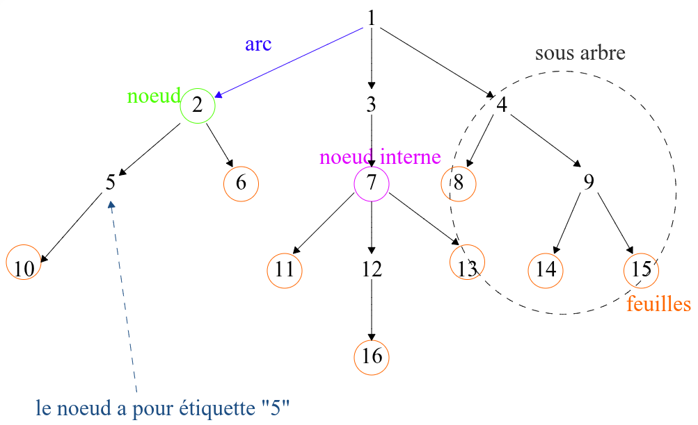
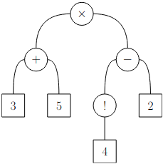
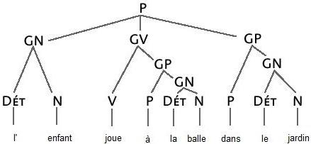
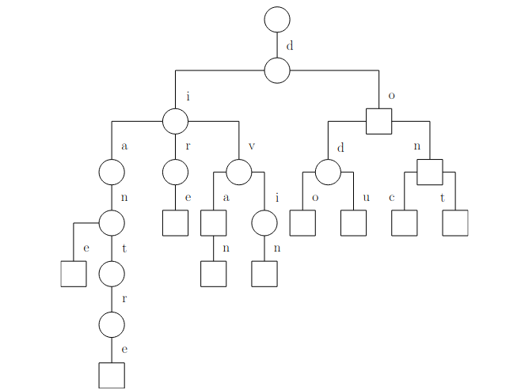

# Chapitre 9: Arbres

$\to$ Structure __hiérarchique__.

## I. Généralités sur les arbres

### 1. Vocabulaire

Ici, 3 est *père* de 7 et 7 est *fils* de 3. 4 a pour *déscendance* 15 et 15 a pour *ancêtre* 4.

1 est la racine de l'abre.

Les feuilles n'ont pas de fils et la racine n'a pas de pères.

> __Taille__
>
> nb de noeuds.

___

> __Arité__
>
> - d'un noeud = aux nombres de fils de ce noeud.
> - de l'arbre = a l'arité maximale de tous ses fils.

___

> __Profondeur__ (d'un noeud)
>
> l'étage du noeud (on commance à 0) = le nombre d'arcs qui le sépare de la racine

___

> __Hauteur__ (de l'arbre)
>
> la pronfondeur maximale de tous les noeuds.

### 2. Définition mathématique

> Un arbre $A$ est un ensemble non vide muni d'une relation binaire $R$ vérifiant:
>
> - $\exist ! r \in A, \forall x \in A, \neg (r R n)$ , $r$ est la racine.
> - $\forall n \in A, \neg (\forall m \in A \backslash \{r\}, \neg (nRm)) \implies \exist ! p \in A, nRp$ autrement dit $\forall n \in A \backslash \{r\}, \exist ! p \in A, nRp$ .
> - $\forall n \in A \backslash \{r\}, \exist p \geq 1, \exist (n {\scriptsize 1}, \dots, n {\scriptsize p-1}) \in A ^{p-1}, nRn{\scriptsize 1}Rn {\scriptsize 2} R\dots R n {\scriptsize p-1}Rr$

### 3. Exemples d'utilisations

- Le système de fichier est un arbre.
- L'abre des appels récursifs.
- arbres arithmétiques

Exemple: $(3 + 5) \times (4! - 2)$ donne l'arbre:

(utilisé dans la calculatrice)

On retrouve l'opération à l'aide d'un parcours __infixe__

- arbres syntaxiques

- trie

représente des mots.

## II. Arbres binaires

### 1. Notion d'induction structurelle

$\to$ manière classique de définir un ensemble en info.

> __Définition__
>
> Un ensemble $E$ est définit par induction structurelle par la donné
>
> - des *assertions* : éléments "de base" appartenant à $E$
> - des *règles d'inférence* : "constructeurs", fonctions $\varphi E \mapsto E$ telles que si $e {\scriptsize 1}, \dots e {\scriptsize n} \in E$ alors $\varphi(e {\scriptsize 1}, \dots e {\scriptsize n}) \in E$
