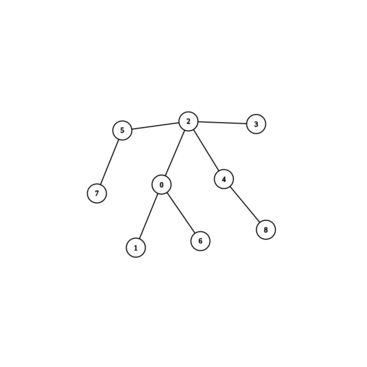

# Chapitre 11 : les Graphes

-> structure ralationnelle

## I. Définitions

### 1. Graphes non orientés

__Def__ : un graphe est un couple $(S, A)$:

- $S$ est un enseble non vide do$s_1$ est accessible depuis $s_2$ nt les élément sont appelés sommets.
- $A$ est un enseble de paires non ordonnées $\{s_1, s_2\}$ avec $s_1 \in S$ et $s_2 \in S$ et $s_1 \neq s_2$, dont les éléments sont appelés arrêtes.

On peut adapter cette définition.
-> multi-arrête
-> boucles

Notation: $\{s_1, s_2\} = s_1-s_2$

Voc : Une arrête est __incidente__ à un sommet et $s_1$ et $s_2$ sont dit __voisins__.

Prop: $card(A)\leq \frac{card(S)\times (card(S)-1)}{2}$

### 2. Graphes orientés

__Def__ : un graphe est un couple $(S, A)$:

- $S$ est un enseble non vide dont les élément sont appelés sommets.
- $A$ est un enseble de couples ordonnées $(s_1, s_2)$ avec $s_1 \in S$ et $s_2 \in S$ et $s_1 \neq s_2$, dont les éléments sont appelés arcs

On peut adapter cette définition.
-> multi-arcs
-> boucles

Notation: $(s_1, s_2) = s_1\to s_2$

Voc : $s_1$ est appelé __prédécesseur__ de $s_2$ et $s_2$ est le successeur de $s_1$.

Prop: $card(A) \leq card(S)\times (card(S)-1)$

## II. Vocabulaire de la théorie des Graphes

### 1. Degré

-> Dans un GNO, le degré d'un sommet $s$ noté $d(s)$ est le nombre d'arrêtes incidentes à ce sommet. i.e. son nombre de voisins.

Prop : Soit $G = (S, A)$ un GNO et soit $s \in S$,

- . $0\leq d(s) \leq card(S) -1$
- $\sum_{s\in S}d(s)=2\times card(A)$

-> Dans un graphe orienté, si $s \in S$:

- Son degré entant, noté $d_-(s)$, est sont nombre de prédécesseurs.
- Son degré sortant, noté $d_+(s)$, est sont nombre de successeurs.

Prop : Soit $G = (S, A)$ un GO et soit $s \in S$,

- On a les inégalité suivantes :
  - $0 \leq d_-(s) \leq card(S)-1$
  - $0 \leq d_+(s) \leq card(S)-1$
- $\sum_{s \in S}d_-(s) = \sum_{s \in S}d_+(s) = card(A)$.

### 2. Sous-graphes

Soit $G = (S, A)$ un graphe.

$G' = (S', A')$ est un sous graphe de G si:

- $S' \subset S$ (et $S'$ est non vide)
- $A' \subset A$ avec $\{s_1, s_2\}/(s_1, s_2) \in A' \implies s_1 \in S' \land s_2 \in S'$

$G'$ est un sous-graphe __induit__ de $G$ si en plus $A'$ est l'intégralité des arrêtes / arcs reliant deux sommets de $S'$ dans $G$.

Prop : un graphe $G = (S, A)$ possède $2^{card(S)}-1$ sous graphes induits.

### 3. Isomorphisme

Un isomorphisme entre 2 graphes $G = (S, A)$ et $\tilde{G} = (\tilde{S}, \tilde{A})$ est une bijection $\varphi : S \to \tilde{S}$ telle que $\forall (s_1, s_2) \in S, \{s_1, s_2\} \in A \implies \{\varphi (s_1), \varphi (s_2)\} \in \tilde{A}$

Autrement dit, en renommant les sommets, les deux graphes ont exactement les mêmes ensembles d'arcs/arrêtes.

### 4. Chemins

Un chemin de longueur n dans un graphe $G = (S, A)$ est une suite de $n + 1$ sommets $s_0, s_1, s_2,\dots,s_n$ telle que $\forall i \in [\![0, n-1]\!], \{s_i, s_{i+1}\} \in A$.

-> Un chemin de longueur $n$ a $n$ arrêtes/arcs.

-> On accepte les chemins de longueur $0$.

Un chemin est dit __élémentaire__ s'il ne passe pas 2 deux fois par le même sommet.

Un chemin est dit __simple__ s'il ne passe pas deux fois par la/le même arrête/arc.

Prop : Tout chemin est un chemin élémentaire est simple (se prouve trivialement par l'absurde).

Un __cycle__ est un chemin simple de longueur non nulle dont les extrémotés sontle même sommet. Un cycle élémentaire est un cycle où la seule répétition est l'extrémité.

-> circuit (cycle pour les GO)

Dans un GNO, les cycles sont au moins de longueur $3$.

Dans un GO, les circuit dont au moins de longueur $2$.

Prop : Les 3 points sont équivalents :

1. Il existe un chemin de $s_1$ à $s_2$.
2. Il existe un chemin simple de $s_1$ à $s_2$.
3. Il existe un chemin élémentaite de $s_1$ à $s_2$.

### 5. Accessibilité

Un sommet $s_2$ est dit __accessible__ depuis un sommet $s_1$ s'il existe un chemin allant de $s_1$ à $s_2$. On note $s_1 \leadsto s_2$.

Prop: Dans un GNO la relation d'accessibilité est une relation d'équivalence. (Preuve triviale.) Cependant dans un GO la symétrie n'est pas vérifiée.

### 6. Connexité

-> Dans un GNO.

Un GNO est dit __connexe__ si tous sommet du graphe est accessible depuis tout autre sommet.

Les __composantes connnexes__ d'un GNO sont les sous-graphes induits par la relation d'équivalence d'accessibilité.

Un graphe est connexe $\iff$ il possède une seule composante connexe.

Prop: Soit $G = (S, A)$ un GNO, et soient $s_1 \in S$ et $s_2 \in S$ deux sommets non voisins. (i.e. $\{s_1, s_2\} \notin A$).
Alors si $\tilde G = (S, A \cup \{s_1, s_2\})$, il y a 2 cas possibles:

1. Si $s_1$ et $s_2$ appartiennent à la même composante connexe dans $G$ alors $\tilde G$ possède le même nombre de composantes connexes que G. Cependant on crée forcément un nouveau cycle.
2. Sinon $\tilde G$ possède une composante connexe de moins que $G$. Tout chemin reliant les 2 composantes connexes passe forcément par $s_1-s_2$.

Cette propriété se montre avec une récurrence sur les arrêtes.

-> Dans un GO.

Un GO est dit __fortement connexe__ si, pour tout sommet $s_1$ et $s_2$ d graphe, il existe un chemin reliant $s_1$ à $s_2$.

Un GO est dit __faiblement connexe__ si, l'oublie de l'orientation donne un graphe connexe.

Un GO est dit __fortement connexe__ si, pour tout sommet $s_1$ et $s_2$ d graphe, il existe un chemin reliant $s_1$ à $s_2$ ou un chemin reliant $s_2$ à $s_1$.

La relation $R$ définie sur les GO par:

- $s_1 R s_2 \iff$ ($s_1$ est accessible depuis $s_2$ et $s_2$ est accessible depuis $s_1$)

est une relaion d'équivalence.

Les composantes fortement connexes d'un GO sont les sous-graphes induits par la classe d'équivalence de cette relation $R$.

Un GO à une composante fortement connexe est fortement connexe.

Il y a aussi existance de la notion de composante faiblement connexe.

### 7. Coloration d'un graphe

Une __K-coloration__ dans un graphe $G = (S, A)$ est une fonction $\varphi: k \mapsto [\![0;K-1]\!]$
tq $ \forall (s, a) \in  S², s_1-s_2 \in A \implies \varphi(s_1) \neq \varphi(s_2)$.

Un graphe est dit __K-colorable__ quand il possède une K-coloration.
Le __nombre chromatique__ d'un graphe $G$, noté $\chi(G)$, est le plus petit entier $k$ tel que $G$ est K-colorable.

-> Prop:  $1 \leq \chi(G) \leq card(S)$

Les problème d'ordonnancement se traduisent par un problème de coloration de graphe d'intervalles correspondants.

*ex: sélection d'activité, plus petit sommets possible dans la même couleur.

## III. Graphes particuliers

### 1. Formes particulières

- Graphes __entièrement déconnecté__:

$G = (S,A)$ avec $A \neq \emptyset$.

- Graphes __Compets__ :

$G = (S, A)$ tel que $\forall (s_1, s_2) \in S², s_1-s_2 \in A$, un GNO complet a $\frac{card(S)\times (card(S)-1)}{2}$ arrêtes. Un GO complet a $card(S)\times (card(S) - 1)$ arcs.

- __Graphes chemins__:

Les seuls arrêtes du graphe relient un sommet $i$ au sommet $i+1$.

On peut aussi avoir des GO chemins.

- __Graphes cycles__:

(des graphes chemins mais qui relient le dernier sommet au premier.)

### 2. Prop particulières

- creux / dense :

__creux__ = pax beaucoup d'arrêtes/arcs.

__denses__ = bcp d'arrêtes\arcs.

Aide à choisir la repr du graphe.

- __biparti__ :

Un graphe $G = (S, A)$ est dit biparti si on peut séparer S en deux sous ensembles disjoints $S_A$ et $S_B$ tels que $\forall(s_1,s_2)\in S², s_1-s_2 \implies s_1 \in S_A \land s_2 \in S_B $ ou inversement.

Les graphes biparti sont 2-colorables.

- __biparti-complet__:

Sn reprenant la def des graphes biparties, on ajoute que tout sommet de $S_A$ est relié à tout sommet de $S_B$.

- __Planaire__:

On peut trouver une repr grarphique sur un plan tel qu'aucun arc/arrête se croise.

-> Prop: Le graphe complet à $5$ sommets et bipout-complet à $3 + 3$ sommets sont les plus petits graphes planaires.

Tout graphe qui contient un de ces deux sous graphes ne sont pas planaire.

- __graphes eulérien__:

Un __chemin eulérien__ est un chemin simple qui passe par toutes les arrêtes du graphe (i.e. de longueur $card(A)$).

Un __cycle eulérien__ est un chemin eulérien où les deux extrémités sont le même sommet.

Un __graphe eulérien__ est un graphe qui possède un cycle eulérien.

- __graphes hamiltonien__:

Un __chemin hamiltonien__ est un chemin élémentaire qui passe par toutes les arrêtes du graphe (i.e. de longueur $card(S) -1 $).

Un __cycle hamiltonien__ est un chemin hamiltonien où la seule répétition de sommet est e départ et l'arrivée.

Un __graphe hamiltonien__ est un graphe qui possède un cycle hamiltonien.

## 3. les Arbres

On peut redéfinir une notion "d'arbre" dans le voc de la théorie des graphes. Un arbres est un graphe __connexe__ est __acyclique__ (i.e. pas de cycles).

⚠️ On ne retrouve pas les arbres définis inductivement.

- __GNO acyclyques__:

Prop: tout GNO acyclique possède un sommet de degré inférieur ou égal à 1.

-> Preuve par l'absurde : Supposons que tous les degrés soit supérieur ou égal à 2. On peur construire un chemin allant de sommet en sommet sans 2 arrêtes consécutives égales (les degré étant supérieur ou égal à 2, on peurt se déplacer sur un sommet différent de celui sont on vient). Le nmbre de sommet étant fini on finit par revenir sur un sommet déhà dans le chemin i.e. on crée un cycle.

__Théorème__ : Un GNO acyclique $G=(S, A)$ possède au plus $card(S) - 1$ arrêtes.

-> Preuve: Par récurrence sur le nb de sommets:

- Un graphe à 1 sommet possède 0 arrête.
- Supposons le th vrai pour un graphe à $n$ sommets. Montrons le résultat pour un graphe à $n+1$ sommets. Soit $G$ un graphe à $n+1$ sommets. D'après la prop présédente, $G$ possède un sommet $s$ tal que $d(s) \leq 1$. Le sous-graphe induit de $G$ privé de $s$ est acyclique à $n$ sommets donc par H.R. a $n-1$ arrêtes. Donc le nombre d'arrêtes de $G$ est de $n - 1 + d(s) \leq n$.

Ce qui clôt la récurrence.

- __GNO connexes__:

__Théorème__: Un GNO connexe $G=(S, A)$ possède au moins $card(S) -1$ arrêtes.

-> Preuve: par récurrence

- Hérédité: $H_n \implies H_{n+1}$. Soit $G$ un GNO à $n+1$ sommets. Par disjonction de cas:
  - S'il existe un sommet $s$ de degré 1, le sous graphe induit de $G$ privé de $s$ est connexe à $n$ sommets. donc par H.R. possède au moins $n-1$ arrêtes. Donc $G$ possède $n-1+1 = n$ arrêtes.
  - Si tous les sommets sont au moins de degré 2. $\frac{1}{2} \sum_{s\in S}d(s) = card(A)$ donc ici comme pour tout sommet $s$, $d(s) \geq 2$, on a $\frac{1}{2} \sum_{s \in S}d(s) \geq card(S)$ i.e. $card(A) \geq card(S)$.

Ce qui clôt la récurrence.

- __Caractérisation des arrbres__:

Soir $G = (S, A)$ un GNO. Les énoncés suivant sont équivalents:

1. $G$ est un arbre.
2. $G$ est acyclique et a $card(S) -1 $ arrêtes.
3. $G$ est connexe et a $card(S) -1$ arrêtes.
4. Pour tout sommets $s_1$ et $s_2$ de $G$ il existe un unique chemin élémentaite de $s_1$ à $s_2$.
5. $G$ est minimalement connexe.
6. $G$ est macimalement acyclique.

-> Preuve: Les th précedents donne $1. \implies 2.$ et $1 \implies 3.$.

- Montrons que $3. \implies 1.$. Par l'absurde, supposons un graphe $G=(S, A)$ connexe avec $card(A) = card(S) -1$ possède un cycle. $G$ privé de cette arrête est tonjours connexe et possède $card(S) - 2$ arrêtes. Impossible.

- Mq $2. \implies 1.$ Prenons un graphe $G=(S,A)$ acyclique tel que $card(A) = card(S) -1$. Montrons que $G$ possde 1 seule composante connexe. Notons $c$ le nombre de composantes connexes de $G$. et $n_1, n_2, \dots , n_c$ les nb de sommets de ces composantes connexes. Les composantes connexes sont des arbres. (connexes par définition et acyclique car G est acyclique.) Donc une composante connexe à $n_i$ sommets possède $n_i -1$ arrêtes.Le nb d'arrêtes de G est $\sum_{i=1}^{c}(n_i -1) = card(S) - c$ comme $card(A) = card(S) -1$ alors $ c=1$ donc $G$ connexe.

- Mq $1 \iff 4.$ Si $G$ est un arbre alors il est acyclique et connexe. Soit $s_1$ et $s_2$ des sommets de $G$. Donc $s_2$ est accessible depuis $s_1$. Si ce chemin n'est pas unique alors il existe un cycle dans $G$. Réciproquement, si pour tout sommets il existe un unique chemin, il y a l'accessibilité, donc la connexité et l'unicité du chemin implique l'acyclicité. D'où l'équivalence.

Une __forêt__ est un GNO acyclique. Ses composantes connexes sont donc des arbres.

Un __arbre enraciné__ est un arbre (connexe et acyclique) dont on a distinguer un sommet particulier comme étant la racine.

-> Ex:


est un arbre et si on l'enracine en 0 on a :


-> __Def__: un __arbre couvrant__ est un graphe $G = (S,A)$ est un sous-graphe $\tilde G = (\tilde S, \tilde A)$ tel que $\tilde S = S$ (même sommets) et $\tilde A \subset A$ tel que $\tilde G $ est un arbre (connnexe acyclique).

__Théorème__ : Tout GNO connexe admet un arbre couvrant.

Considérons l'algo suivant:

- Entrée : un graphe $G = (S, A)$ non orienté connexe

```On prend G' = (S, A') avec A' = A
TANT QUE |A'| > |S|-1 FAIRE
    on prend a appartenant à A' telle que G' privé de a est connexe
    A' <- A'\{a}
FIN TANT QUE
RENVOYER G'
```

Variant: $card(A')$; et invariant: $G'$ est connexe.

### 4. Graphes pondérés

-> __Def__: un graphe podéré est un graphe $G = (S, A, \omega)$ avec $S$ l'ensemble des sommets, $A$ l'ensemble des arcs/arrêtes, et $\omega : A \mapsto \R$ une __fonction de pondération__ qui à un arc aussocie son __poids__

On étend usuéellement $\omega$ pour que $s_1-s_2 \notin A \implies \omega(s_1-s_2) = +\infty$.

-> Application: les gaphes pondérés représentent bien tous les tyes de réseaux.

-> __Def__: On définit le poids d'un chemin $s_1, s_2, \dots, s_n$ dans un graphe pondéé comme $\sum_{i=1}^{n-1}\omega (s_i-s_{i+1})$.

Un pb classique sur les graphes pondérés consiste à trouver le plus petit poids entes deux sommets.
