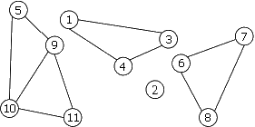
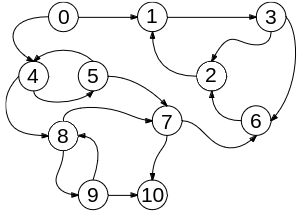

# TD : Raisonner sur les graphes

## Graphes non orientés

Graphe étudié : 

### 1)

Le graphe ci contre est 3-colorable. Ces degrés sont:

$$
\begin{align*}
    d(1) &= 2 \space ,  &d(2) = 0 \\
    d(3) &= 2 \space ,  &d(4) = 2 \\
    d(5) &= 2 \space ,  &d(6) = 2 \\
    d(7) &= 2 \space ,  &d(8) = 2 \\
    d(9) &= 3 \space ,  &d(10) = 3 \\
    d(11) &= 2 \space
\end{align*}
$$

### 2)

Non le graphe n'est pas connexe, cependant il possède 4 composantes connexes. Il possède 34 cycles.

### 3)

Oui.

### 4)

Un sous graphe induit par $\{1,2,3,9,19,11\}$ est $\tilde G = (\{1,2,3,9,19,11\}, \space \{1-3, 9-10, 9-11, 10-11\} )$. un ensemble ayant le même nombre de sommet est $\bar G = (\{1,2,3,9,19,11\}, \space \emptyset )$.

### 5)

Par l'absurde, si le nombre de sommets de degré impair est impair alors $\sum_{s \in S}d(s)$ est impair. absurde.

### 6)

Ce montre par disjonction de cas dans l'hérédité d'une récurrence. $\space \leadsto \text{exo}$.

## Graphes orientés

Graphe étudié : 

### 9)

Les degrés entrant sont :

$$
\begin{align*}
    d_-(1) &= 2 \space ,  &d_-(2) = 2 \\
    d_-(3) &= 1 \space ,  &d_-(4) = 2 \\
    d_-(5) &= 1 \space ,  &d_-(6) = 2 \\
    d_-(7) &= 2 \space ,  &d_-(8) = 2 \\
    d_-(9) &= 1 \space ,  &d_-(10) = 2 \\
    d_-(0) &= 0 \space
\end{align*}
$$

Les degrés sortant sont :

$$
\begin{align*}
    d_+(1) &= 1 \space ,  &d_+(2) = 1 \\
    d_+(3) &= 2 \space ,  &d_+(4) = 2 \\
    d_+(5) &= 2 \space ,  &d_+(6) = 1 \\
    d_+(7) &= 2 \space ,  &d_+(8) = 2 \\
    d_+(9) &= 2 \space ,  &d_+(10) = 0 \\
    d_+(0) &= 2 \space
\end{align*}
$$

### 10)

Il n'est pas fortement connexe. Il possède au moins 2 (flemme de compter).

Il est faiblement connexe
